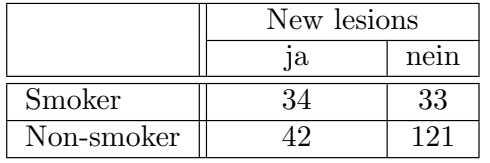
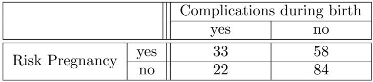
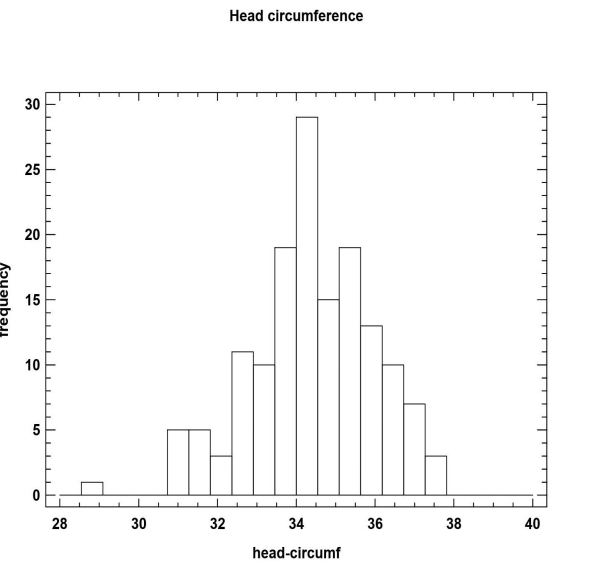
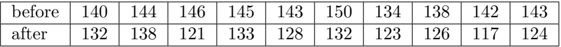
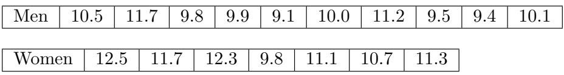
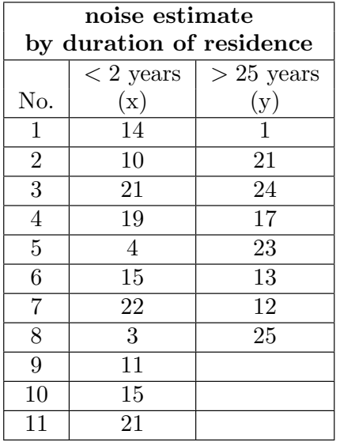

5. In a clinic, the proportion of patients suffering from diabetes mellitus is 20 %. 30 % of the patients suffer from heart disease, 5 % have both diseases. What is the proportion of patients who have only one of the two diseases?
**A = patients suffering from diabetes mellitus 
B = patients suffering from heart disease
C = patients who have only one of the two diseases**
$$
\begin{aligned}
    P(A) &= 0.2 \\
    P(B) &= 0.3 \\
    P(AB) &=  0.05 \\
    P(C) &= P(A \cup B) - P(AB) \\
    &= P(A) + P(B) - 2P(AB) \\
    &= 0.2 + 0.3 - 2 \cdot 0.05 \\
    &= 0.4 
\end{aligned}
$$

6. Ignaz Semmelweis determined for one month in 1846 that 24 % of women giving birth in a ward of the Vienna maternity hospital had puerperal fever. At that time, the probability of a sick woman dying of puerperal fever was 80%. What was the probability of a woman falling ill with puerperal fever and dying from it?
**I = a woman falling ill with puerperal fever
D = a woman dying from puerperal fever**
$$
\begin{aligned}
    P(I) &= 0.24 \\
    P(D \mid I) &= 0.8 \\
    P(DI) &= P(I) \cdot P(D \mid I) \\
    &= 0.24 \cdot 0.8 \\
    &= 0.192
\end{aligned}
$$

7. A total of 2805 new cases were reported to the clinical tumor registry in Nanjing in 2023. The places of residence of patients from Jiangsu Province had the following distribution:
***Counties in Jiangsu (outside Nanjing) 1254 
City of Nanjing 1258
Other districts in Jiangsu 176***
What is the probability that a randomly selected registration form does not originate from Jiangsu?
$$
\begin{aligned}
    P &= \frac{2805-(1254+1258+176)}{2805}\\
    &= 0.0417 = 4.17\%
\end{aligned}
$$

8. In a screening examination, 15% of the people examined had heart disease and 10% had lung disease. 80% had neither disease. What was the proportion of people examined who had both heart and lung disease?
**A = people had heart disease
B = people had lund disease**
$$
\begin{aligned}
    P(A) &= 0.15\\
    P(B) &= 0.1\\
    P(\overline{A \cup B})&=P(\overline{A} \cap \overline{B}) =0.8\\
    P(A \cup B) &=1 - P(\overline{A \cup B})=0.2 \\
    P(AB) &= P(A) + P(B) - P(A \cup B)\\
    &= 0.15 + 0.1 -0.2\\
    &= 0.05
\end{aligned}
$$

9. A health insurance company determines that only 8% of car drivers who were wearing seat belts had head injuries in road accidents. In the case of drivers not wearing seat belts, 62% suffered no head injuries in an accident.
Despite the obligation to wear a seatbelt, 10 % of all drivers still do not wear a seatbelt.
What is the probability that a driver after an accident with head injuries was not wearing a seatbelt?
**W = driver was wearing a seat belt
H = driver has head injuries**
$$
\begin{aligned}
    P(H \mid W) &= 0.08\\
    P(\overline{H} \mid \overline{W}) &= 0.62\\
    P(\overline{W}) &= 0.1\\
    P(\overline{W} \mid H) &= \frac{P(H \mid \overline{W})\cdot P(\overline{W})}{P(H \mid W)\cdot P(W)+P(H \mid \overline{W}) \cdot P(\overline{W})}\\
    &= \frac{0.38 \cdot 0.1}{0.08 \cdot 0.9 + 0.38 \cdot 0.1}\\
    &= 0.3455=34.55\%
\end{aligned}
$$

10.  You have just returned from vacation. During your stay, you learned that there is a rare viral disease there. You decide to have a test carried out after your return, as the chances of recovery are significantly better with early detection than after the outbreak of the disease. A few days after the test, your doctor calls you and tells you that your test is positive. He gave you additionally the following information:
1、In infected persons, tropical fever is detected in 99 % of cases.
On the other hand, 98 % of non-infected people are recognized as healthy.
2、Tropical fever only occurs in about one in every thousand tourists who visit this country
The disease shows no symptoms within the first few days.
What is the probability that you are actually infected?
**I = infected
\+ = postive**
$$
\begin{aligned}
    P(+ \mid I) &= 0.99\\
    P(- \mid \overline{I}) &= 0.98\\
    P(I) &= 0.001\\
    P(I \mid +) &= \frac{P(+ \mid I)\cdot P(I)}{P(+ \mid I)\cdot P(I)+P(+ \mid \overline{I}) \cdot P(\overline{I})}\\
    &= \frac{0.99 \cdot 0.001}{0.99 \cdot 0.001 + 0.02 \cdot 0.999}\\
    &= 0.0472= 4.72\%
\end{aligned}
$$

11. 

sensitivity = $\frac{tp}{tp + fn} = \frac{410}{796}$
specitivity = $\frac{tn}{tn + fp} = \frac{146}{204}$
positive predicitive value = $\frac{tp}{tp + fp} = \frac{410}{468}$
negative predicitive value = $\frac{tn}{tn + fn} = \frac{146}{532}$

12.  In a screening examination of 8000 women, 500 of them were diagnosed with the disease. Subsequent special diagnostics confirmed 400 of these women as really ill and a further 120 cases of the disease were identified. Calculate the predictive values, the sensitivity and the specificity.

||sick|healthy| .|
|-|-|-|-|
test positive|400|100|500|
test negative|120|7380|7500|
||520|7480|8000|

sensitivity = $\frac{tp}{tp + fn} = \frac{400}{520}$
specitivity = $\frac{tn}{tn + fp} = \frac{7380}{7480}$
positive predicitive value = $\frac{tp}{tp + fp} = \frac{400}{500}$
negative predicitive value = $\frac{tn}{tn + fn} = \frac{7380}{7500}$

14. In a cardiologic study, the question of whether the occurrence of new lesions in the coronary vessels is associated with the factor ‘“ smoking“ was investigated. The following results were found in 230 patients
after 3 years of observation (the absolute frequencies are shown):

RR = $\frac{34/(34+33)}{42/(42+121)} = 1.9694$
OR = $\frac{34/42}{33/121} = 2.9683$

15. The question to be investigated is whether the occurrence of complications in the mother is associated with a pregnancy entered as a risk in the maternity record. The result is as follows, with the absolute
frequencies shown:

RR = $\frac{34/(33+58)}{22/(22+84)} = 1.8002 $
OR = $\frac{33/22}{58/84} = 2.1724$

16. Data on newborns is collected in a neonatal study. It is shown that the head circumference of the newborns is approximately normally distributed with a mean value of 34.8 cm and a standard deviation of 1.57 cm.
In which range are 95% of the values to be expected?

$$
\begin{aligned}
    X \sim N(34.8,1.57^2) \\
    (\mu -2\sigma,\mu + 2\sigma)\\
    (31.66,37.94)
\end{aligned}
$$

17. According to the manufacturer, certain tablets contain an average of 400 mg of an active ingredient. The active substance is normally distributed. The standard deviation is 5 mg. Calculate the proportion of tablets whose active ingredient content is greater than 395 mg and less than 405 mg.
$$
\begin{aligned}
    X \sim N(400,5^2) \\
    (\mu -\sigma,\mu + \sigma) &= (395,405)\\
    P(395\lt X \lt 405) &= 0.6826
\end{aligned}
$$

18. It can be assumed that the hematocrit value of men is normally distributed with the parameters µ = 0.46 and σ = 0.03. The reference range for women is known and is given as 0.35-0.47. What is the probability that a randomly selected male person has a hematocrit value that is greater than the upper bound of the reference interval for women?
$$
\begin{aligned}
    X \sim N(0.46,0.03^2) \\
    P(X \gt 0.47) &= P(\frac{X -0.46}{0.03}\gt \frac{0.47 -0.46}{0.03}) \\
    P(\frac{X -0.46}{0.03}\gt 0.33) &= 1 - 0.6293 = 0.3707
\end{aligned}
$$
查标准正态分布表z=0.33，$\int_{-\infty}^{0.33} f(x) \, dx = 0.5 + 0.1293 = 0.6293$

19. In a study to investigate the change in blood pressure in 32 hypertensive patients during the course of treatment, diastolic blood pressure is measured before and after treatment. The mean value of the differences (pre-value - post-value) is 21.7 mmHg and their standard deviation is 9.7 mmHg. State the 95% confidence interval for the expected value of the differences in the population.
(Note: The 97.5% quantile of the t-distribution with 31 degrees of freedom is 2.04)
$$
\begin{aligned}
    \overline{X} &= 21.7\\
    S &= 9.7\\
    n &= 32\\
    \overline{X} + t_{31,0.975} \cdot \frac{S}{\sqrt{n}} &= 25.1981\\
    \overline{X} - t_{31,0.975} \cdot \frac{S}{\sqrt{n}} &= 18.2019
\end{aligned}
$$
So the result is:$[18.2019;25.1981]$

20. The mean uric acid value in serum for men is given by a reference laboratory as 305 µmol/l. The analysis of 16 blood samples from women yielded an average value of $\overline{x}$ = 260 µmol/l with a standard deviation of s = 50 µmol/l. Calculate the 95% confidence interval for the expected value of uric acid in serum in women.
(Note: The 0.975 quantile of the t-distribution with 15 degrees of freedom is 2.13)
$$
\begin{aligned}
    \overline{X} &= 260\\
    S &= 50\\
    n &= 16\\
    \overline{X} + t_{15,0.975} \cdot \frac{S}{\sqrt{n}} &= 286.625\\
    \overline{X} - t_{15,0.975} \cdot \frac{S}{\sqrt{n}} &= 233.375
\end{aligned}
$$
So the result is:$[233.375;286.625]$

21. The daily requirement of vitamin C in healthy adults is about 100 mg. In a group of 8 test subjects, the following amounts of vitamin C were consumed with food:
`Vitamin C` `90` `84` `106` `74` `92` `98` `74` `70`
It is suspected that the test subjects are not meeting their daily requirements. Formulate a suitable hypothesis and test it at the significance level α = 0.05.
$$
\begin{aligned}
    H_0:\mu &\ge 100 \\
    H_1:\mu &\lt 100 \\
\end{aligned}
$$
one sample t-test

22. A group of 10 subjects with high blood pressure was administered a newly developed antihypertensive
drug. The following blood pressure values were measured before and after taking the medication.

Check the effectiveness of the drug under the assumption that the differences are normally distributed.
$$
\begin{aligned}
    \mu_{diff} &= \mu_{post} - \mu_{pre}\\
    H_0:\mu_{diff} &= 0 \\
    H_1:\mu_{diff} &\ne 0 \\
    & \lt 这题选小于，我们希望\mu_{diff}的值是负的，采取单侧检验\\ 
    & \gt
\end{aligned}
$$
one sample t-test,since 'before' and 'after' are dependent and paired

23. It is assumed that iron absorption is different in women and men. This should be checked using a sample
of 10 men and 7 women. The following table shows the amounts of iron in mg:

Formulate a suitable hypothesis and test it assuming normally distributed data (α = 0.05).
$$
\begin{aligned}
    H_0:\mu_{M} - \mu_{F} & = 0 \\
    H_1:\mu_{M} - \mu_{F} &\ne 0 \\
\end{aligned}
$$
two sample t-test,since 'Men' and 'Women' are independent

24. The Federal Ministry of Health has commissioned a study to examine the effects of aircraft noise on people’s health. One part of the study deals with the subjectively perceived loudness of aircraft noise. To this end, two groups of residents living near Frankfurt Airport’s approach path were given a specially designed questionnaire. Higher values mean a greater perception of loudness. One group of residents has lived in the flight path for more than 25 years, the other group for less than 2 years. It is assumed that people who have lived in the flight path for a long time have a different perception of loudness than new residents.

Formulate a suitable hypothesis and test it using the Wilcoxon rank sum test.
$$
\begin{aligned}
    H_0:Median(\lt 2) &= Median(\gt 25) \\
    H_1:Median(\lt 2) &\ne Median(\gt 25)\\
\end{aligned}
$$

25. A psychologist offers meditation training to residents living near flyways to help them cope better with the noise. To monitor the success of the meditation training, he surveys the subjective perception of aircraft noise before and after the training using a specially designed questionnaire and obtains the data shown in the following table.