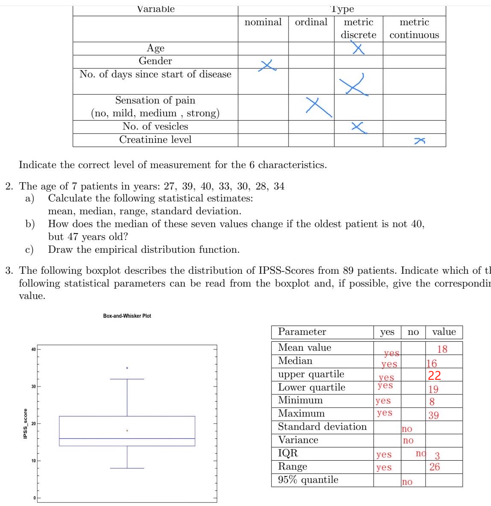
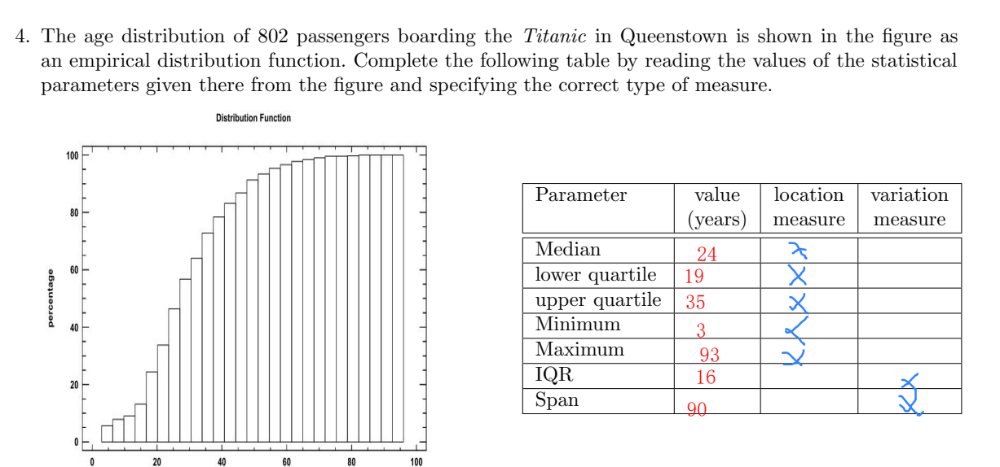
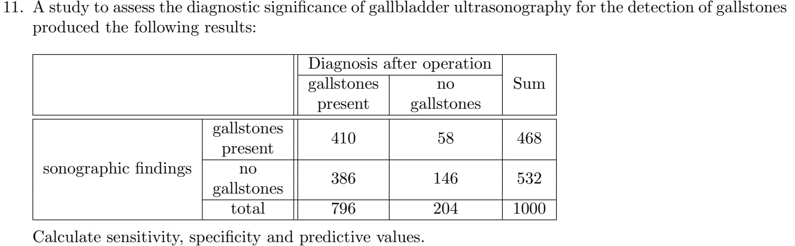

5. In a clinic, the proportion of patients suffering from diabetes mellitus is 20 %. 30 % of the patients suffer from heart disease, 5 % have both diseases. What is the proportion of patients who have only one of the two diseases?
**A = patients suffering from diabetes mellitus 
B = patients suffering from heart disease
C = patients who have only one of the two diseases**
$$
\begin{aligned}
    P(A) &= 0.2 \\
    P(B) &= 0.3 \\
    P(AB) &=  0.05 \\
    P(C) &= P(A \cup B) - P(AB) \\
    &= P(A) + P(B) - 2P(AB) \\
    &= 0.2 + 0.3 - 2 \cdot 0.05 \\
    &= 0.4 
\end{aligned}
$$

6. Ignaz Semmelweis determined for one month in 1846 that 24 % of women giving birth in a ward of the Vienna maternity hospital had puerperal fever. At that time, the probability of a sick woman dying of puerperal fever was 80%. What was the probability of a woman falling ill with puerperal fever and dying from it?
**I = a woman falling ill with puerperal fever
D = a woman dying from puerperal fever**
$$
\begin{aligned}
    P(I) &= 0.24 \\
    P(D \mid I) &= 0.8 \\
    P(DI) &= P(I) \cdot P(D \mid I) \\
    &= 0.24 \cdot 0.8 \\
    &= 0.192
\end{aligned}
$$

7. A total of 2805 new cases were reported to the clinical tumor registry in Nanjing in 2023. The places of residence of patients from Jiangsu Province had the following distribution:
***Counties in Jiangsu (outside Nanjing) 1254 
City of Nanjing 1258
Other districts in Jiangsu 176***
What is the probability that a randomly selected registration form does not originate from Jiangsu?
$$
\begin{aligned}
    P &= \frac{2805-(1254+1258+176)}{2805}\\
    &= 0.0417 = 4.17\%
\end{aligned}
$$

8. In a screening examination, 15% of the people examined had heart disease and 10% had lung disease. 80% had neither disease. What was the proportion of people examined who had both heart and lung disease?

9. A health insurance company determines that only 8% of car drivers who were wearing seat belts had ˙
head injuries in road accidents. In the case of drivers not wearing seat belts, 62% suffered no head injuries in an accident.
Despite the obligation to wear a seatbelt, 10 % of all drivers still do not wear a seatbelt.
What is the probability that a driver after an accident with head injuries was not wearing a seatbelt?

10. You have just returned from vacation. During your stay, you learned that there is a rare viral disease there. You decide to have a test carried out after your return, as the chances of recovery are significantly better with early detection than after the outbreak of the disease. A few days after the test, your doctor calls you and tells you that your test is positive. He gave you additionally the following information:
1、In infected persons, tropical fever is detected in 99 % of cases.
On the other hand, 98 % of non-infected people are recognized as healthy.
2、Tropical fever only occurs in about one in every thousand tourists who visit this country
The disease shows no symptoms within the first few days.
What is the probability that you are actually infected?

11. 

12. In a screening examination of 8000 women, 500 of them were diagnosed with the disease. Subsequent special diagnostics confirmed 400 of these women as really ill and a further 120 cases of the disease were identified. Calculate the predictive values, the sensitivity and the specificity.

||sick|healthy| .|
|-|-|-|-|
test positive|400|100|500|
test negative|120|7380|7500|
||520|7480|8000|

sensitivity = $\frac{tp}{tp + fn} = \frac{400}{520}$
specitivity = $\frac{tn}{tn + fp} = \frac{7380}{7480}$
positive predicitive value = $\frac{tp}{tp + fp} = \frac{400}{500}$
negative predicitive value = $\frac{tn}{tn + fn} = \frac{7380}{7500}$

In a cardiologic study, the question of whether the occurrence of new lesions in the coronary vessels is associated with the factor ‘“ smoking“ was investigated. The following results were found in 230 patients
after 3 years of observation (the absolute frequencies are shown):

In a study to investigate the change in blood pressure in 32 hypertensive patients during the course of treatment, diastolic blood pressure is measured before and after treatment. The mean value of the differences (pre-value - post-value) is 21.7 mmHg and their standard deviation is 9.7 mmHg. State the 95% confidence interval for the expected value of the differences in the population.
$$

$$

