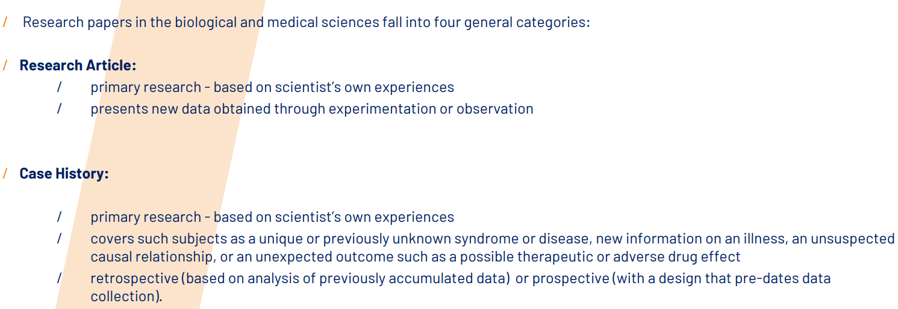

# 9.11

## exam related questions

1. ***You're about to choose how your study will be disseminated:what are the fundamental questions you should think about before proceeding?Explain and justify.***

- What  message  do  I  want  to  convey?
  / What is your research question(and possibly answer)?
- Who  will  be  interested  in  my  message?
  / So what?What effect will my messages have on concepts or practices?
- What  format  is  most  appropriate  for  my  message?
  / How will you structure the text to make it reader-friendly for your audience?
- Where  should  this  paper  be  published?
  / Where should this paper be published?

1. ***Think about the characteristics of primary research(Research articles and case histories),summarize their structure,including sections.(introduction,literature review,methods...)***

Similar Structure:
They parallel the sequence of a critical argument.
They present a question (often formally stated as a hypothesis).
They marshal evidence to support various possible answers to the question or tests of the 
hypothesis.
They attempt to persuade the reader of the truth of a particular choice of answers.

1. ***How would you define scientific writing style?What are its main objectives?***
“Scientific writing”
/    can be narrowly defined as the reporting of original research in peer- 
reviewed journals, or:
/    review articles, abstracts, case study reports, grant proposals 
and summaries,posters, and slide-based presentations.
/ must answer basic questions and address problems raised during the dialogs 
that identify and define a given subject.
/ is clear, concise, and follows established formats.