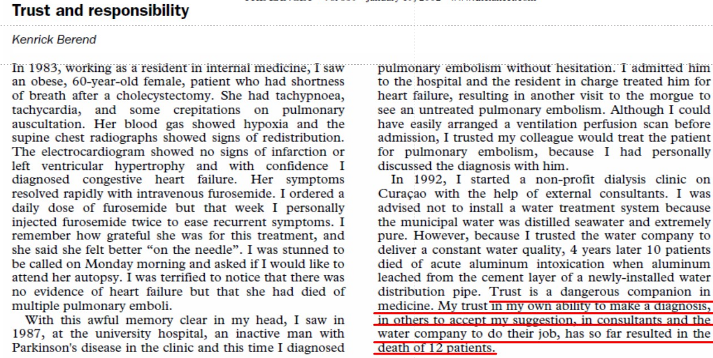
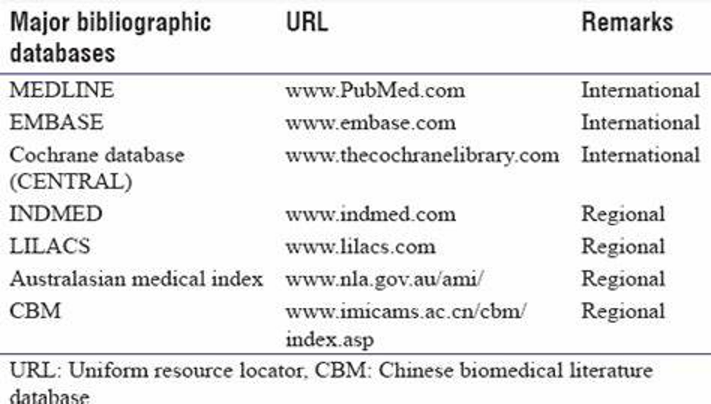
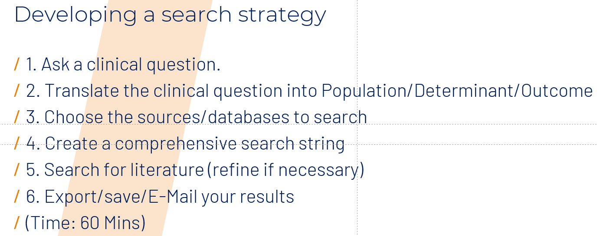

# 9.12

## Exercise

**注：All the given answers should be  extended,suggested length is 100 words.**

### Part1

***What are the characteristics of a literature review?***(enlarge the answer to around 100 words)
Scientific account of what has already been published on a specific topic.

Be organised around a specific research question/ topic

Synthesize information into a summary of what is and is not known

Identify areas of uncertainty/ controversy

Create questions that need further research

***Where can you find answers to your questions?***(enlarge the answer to around 100 words)
Possible sources of information：
Colleagues:They may have research histories.

Books:
Lack of timeliness (3 to 5 years)
Affordability (price) and access

Search Engines - (Google), Baidu

Journals:
Timely (particularly open access).
Be aware of publication bias.
Affordability and access.

Databases:
Comprise lots of journals, books and other information like conference proceedings.
Also, be aware of  publication bias, affordability and access.

***Are colleagues a realiable source of information when searching for information? Explain.***(enlarge the answer to around 100 words)

We cannot trust our colleages completely.Trust is a dangerous companion in medicine.

***What is PubMed useful for? Explain.***(enlarge the answer to around 100 words)

### part2

***What is the starting point of a review search? Explain***
 Use knowledge, logic and creativity
Start with good Research Question
**Population
Determinant/ Exposure
Outcome**

Have several terms & synonyms for all
Be aware: UK / US spelling

***What are some of the most important databases to help you through your search process?***
The Cochrane Library comprises six databases:
– CDSR (Cochrane Database of Systematic Reviews)
– DARE (Database of Abstracts of Reviews of Effects)
– CENTRAL (Central Register of Controlled Trials)
– CMR (Cochrane Methodology Register)
– HTA (Health Technology Assessments)
– EED (Economic Evaluations Database)

***Does the Cochrane Library contain evidence regarding etiology?***
**No it doesn't.**
The Cochrane Library is particularly useful, when searching evidence regarding:
the effects of interventions (i.e. different prevention strategies),
 diagnostic test accuracy, 
economic evaluations. 
 However, it contains **no data regarding etiology**,  personal opinions of experts.

***Can you enter your clinical research question directly in search bar? Why***
**No I can't.**
Entering the clinical question directly into the search bar is problematic, since databases mostly are operated by machine language.

We can use Boolean operators.
E.g.:OR(unites quantities);
AND(intersects quantities);
NOT(subtracts quantities) 

We have to convert our clinical question into a machine-readable search string.

### part3

1. Does smoking increase  incidence in pulmonary diseases?
2. population=pulmonary disease;
   determinant=smoking;
   outcome=incidence;
3. Pubmed
4. pulmonary diseases OR lung illnesses
   smoking=taking cigarettes
   incidence=possibility of onset
