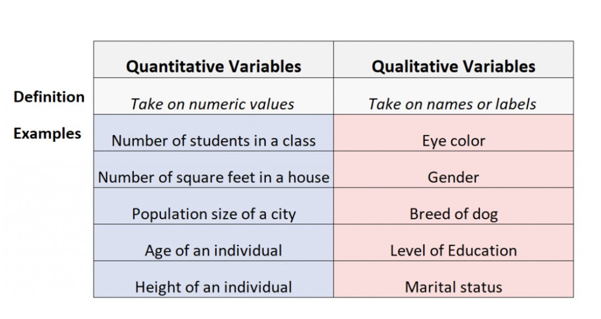
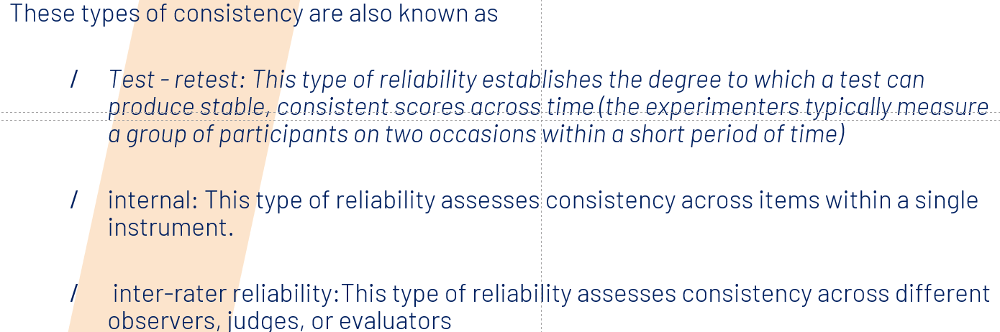

# 9.14

## Exercise

### part1

***1. How do you define a variable?***
Variables are the characteristics or attributes that you are observing, measuring and recording data for - some examples include height, weight, eye colour etc..

***2. Explain what quantitative variables are***
Quantitative Variables: Sometimes referred to as “numeric” variables, these are variables that represent a measurable quantity. Examples include:

Number of students in a class
Number of square feet in a house
Population size of a city
Age of an individual
Height of an individual

***3. Explain what qualitative variables are***
Qualitative Variables: Sometimes referred to as “categorical” variables, these are variables that take on names or labels and can fit into categories. Examples include:

Eye color (e.g. “blue”, “green”, “brown”)
Gender (e.g. “male”, “female”)
Breed of dog (e.g. “lab”, “bulldog”, “poodle”)
Level of education (e.g. “high school”, “Associate’s degree”, “Bachelor’s degree”)
Marital status (e.g. “married”, “single”, “divorced”)

***4. What is a dependent variable?***
The independent variable is the cause. Its value is independent of other variables in your study.

***5. What is an independent variable?***
The dependent variable is the effect. Its value depends on changes in the independent variable.

Example: Independent and dependent variables

You design a study to test whether changes in room temperature have an effect on math test scores.

Your independent variable is the temperature of the room. You vary the room temperature by making it cooler for half the participants, and warmer for the other half.

Your dependent variable is math test scores. You measure the math skills of all participants using a standardized test and check whether they differ based on room temperature.

***6. What is a control variable?***
Control variables, also known as controlled variables, are properties that researchers hold constant for all observations in an experiment. 

While these variables are not the primary focus of the research, keeping their values consistent helps the study establish the true relationships between the independent and dependent variables.

***7. What is a cofounding variable?Make an example***
Confounding means the distortion of the association between the independent and dependent variables because a third variable is independently associated with both.

Example: You decide to compare the mortality rates between two groups – one consisting of heavy users of alcohol, one consisting of teetotallers. In this case alcohol consumption would be your independent variable and mortality would be your dependent variable.

***8.Describe both continuous and discete variables***
Continuous variables is a type of quantitative variable that can take on any value within a certain range or interval. It is a variable that can be measured on a continuous scale, meaning that there are an infinite number of possible values between any two points.

Discrete variables ( can only take on a finite or countably infinite set of values, e.g. number of vertebrae in the human vertebral column;  number of days per week) 
dichotomous /binary discrete variables (categorical variable that can only take one of two values e.g. True or False)

***9. What are the three foundumental quality criteria of scientific tests? Describe each.***
There are three fundamental quality criteria of scientific tests: 
**Objectivity,Reliability,Validity**

In test statistics, objectivity is one of the three main quality criteria for psychological tests, along with reliability and validity, and r**efers to the test’s procedure, result, analysis, and interpretation, being independent of the person conducting the test.**
Procedural objectivity 
Analytic objectivity 
Interpretational objectivity

Scientific criteria: Reliability
**Reliability refers to the consistency of the measure.**
High reliability indicates that the measurement system produces similar results under the same conditions. 

Suppose you have a body scale that displays very inconsistent results from one time to the next. It’s very unreliable. It would be hard to use your scale to determine your correct weight and to know whether you are losing weight

How to assess reliability: 
To evaluate reliability, analysts assess consistency over time, within the measurement instrument, and between different observers. 

**Validity: Validity refers to whether the measurements reflect what they’re supposed to measure.**
Concern when you have to  measure elusive concepts such as fear or  self-esteem. 
How to assess validity?
The measurements must have a positive relationship with other measures of the same construct. Additionally, they need to correlate in the correct direction (positively or negatively) with the theoretically correct constructs. Finally, the measures should have no relationship with unrelated constructs.

### part2

"People with high-sugar diets and sedentary activity levels are more likely to develop depression.“ **TURE**
**If** people with high-sugar diets and sedentary activity levels,**then** they are more likely to develop depression.下面的句子一样分析

"Younger people who are regularly exposed to green, outdoor areas have better subjective well-being than older adults who have limited exposure to green spaces." **TRUE**

Dogs cannot fly. **FALSE(It’s not hypothesis)**
Women are more beautiful than men. **FALSE(opinion)**

"Students who eat breakfast will perform better on a math exam than students who do not eat breakfast." **TRUE**

Students who experience test anxiety before an English exam will get lower scores than students who do not experience test anxiety. **TRUE**

Motorists who talk on the phone while driving will be more likely to make errors on a driving course than those who do not talk on the phone. **TRUE**

If you die you will go to heaven.**FALSE. No variables and cannot be tested.**

Children who receive a new reading intervention will perform better than students who did not receive the intervention.**TRUE**

If a person does not study, they will study chiropractics.
**FALSE. It's a contradiction.**

***What is a hypothesis?What are its characteristics?***
A scientific hypothesis, an idea that proposes a tentative explanation about a phenomenon or a narrow set of phenomena observed in the natural world.

The two primary features of a scientific hypothesis are **falsifiability** and **testability**, <u>which are reflected in an “If…then” statement</u>

***What its a contradiction?***
A contradiction is **two propositions** used in combination where one makes makes the other impossible. It is something that is A and non A at the same time. A contradiction , therefore, cannot exist in reality.

reaching a contradition as a conclusion or evaluation of reality is proof of an error

If a person cannot drive, she or he will drive a car.

**Contradictions are scientifically worthless.**

***What is a tautology?***
**The saying of the same things twice over in different words, generally considered to be a fault of style.**

“He was a man of few words, and he spoke succinctly.” In this case, the words “few” and “succinctly” are redundant as they both mean the same thing. For greater clarity, one of them should be eliminated.

“She was so excited she could hardly contain her elation.” Using either “excited” or “elation” will create more impact than using both words interchangeably, as they mean close to the same thing.

Not falsifiable;

In heaven it is more peaceful than on earth.“ 
(metaphysics)

Tautologies are scientifically worthless.

