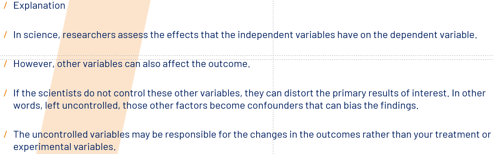

# 9.14

## Exercise

### part1

***1. How do you define a variable?***
Variables are the characteristics or attributes that you are observing, measuring and recording data for - some examples include height, weight, eye colour etc..

***2. Explain what quantitative variables are***
Quantitative Variables: Sometimes referred to as “numeric” variables, these are variables that represent a measurable quantity. Examples include:

Number of students in a class
Number of square feet in a house
Population size of a city
Age of an individual
Height of an individual

***3. Explain what qualitative variables are***
Qualitative Variables: Sometimes referred to as “categorical” variables, these are variables that take on names or labels and can fit into categories. Examples include:

Eye color (e.g. “blue”, “green”, “brown”)
Gender (e.g. “male”, “female”)
Breed of dog (e.g. “lab”, “bulldog”, “poodle”)
Level of education (e.g. “high school”, “Associate’s degree”, “Bachelor’s degree”)
Marital status (e.g. “married”, “single”, “divorced”)

***4. What is a dependent variable?***
The independent variable is the cause. Its value is independent of other variables in your study.

***5. What is an independent variable?***
The dependent variable is the effect. Its value depends on changes in the independent variable.

Example: Independent and dependent variables

You design a study to test whether changes in room temperature have an effect on math test scores.

Your independent variable is the temperature of the room. You vary the room temperature by making it cooler for half the participants, and warmer for the other half.

Your dependent variable is math test scores. You measure the math skills of all participants using a standardized test and check whether they differ based on room temperature.

***6. What is a control variable?***
Control variables, also known as controlled variables, are properties that researchers hold constant for all observations in an experiment. 

While these variables are not the primary focus of the research, keeping their values consistent helps the study establish the true relationships between the independent and dependent variables.

***7. What is a cofounding variable?Make an example***
Confounding means the distortion of the association between the independent and dependent variables because a third variable is independently associated with both.

Example: You decide to compare the mortality rates between two groups – one consisting of heavy users of alcohol, one consisting of teetotallers. In this case alcohol consumption would be your independent variable and mortality would be your dependent variable.

***8.Describe both continuous and discete variables***
Confounding means the distortion of the association between the independent and dependent variables because a third variable is independently associated with both.

Example: You decide to compare the mortality rates between two groups – one consisting of heavy users of alcohol, one consisting of teetotallers. In this case alcohol consumption would be your independent variable and mortality would be your dependent variable.

***9. What are the three foundumental quality criteria of scientific tests? Describe each.***
There are three fundamental quality criteria of scientific tests: 
**Objectivity,Reliability,Validity**

In test statistics, objectivity is one of the three main quality criteria for psychological tests, along with reliability and validity, and r**efers to the test’s procedure, result, analysis, and interpretation, being independent of the person conducting the test.**
Procedural objectivity 
Analytic objectivity 
Interpretational objectivity

Scientific criteria: Reliability
**Reliability refers to the consistency of the measure.**
High reliability indicates that the measurement system produces similar results under the same conditions. 

Suppose you have a body scale that displays very inconsistent results from one time to the next. It’s very unreliable. It would be hard to use your scale to determine your correct weight and to know whether you are losing weight

How to assess reliability: 
To evaluate reliability, analysts assess consistency over time, within the measurement instrument, and between different observers. 

**Validity: Validity refers to whether the measurements reflect what they’re supposed to measure.**
Concern when you have to  measure elusive concepts such as fear or  self-esteem. 
How to assess validity?
The measurements must have a positive relationship with other measures of the same construct. Additionally, they need to correlate in the correct direction (positively or negatively) with the theoretically correct constructs. Finally, the measures should have no relationship with unrelated constructs.

