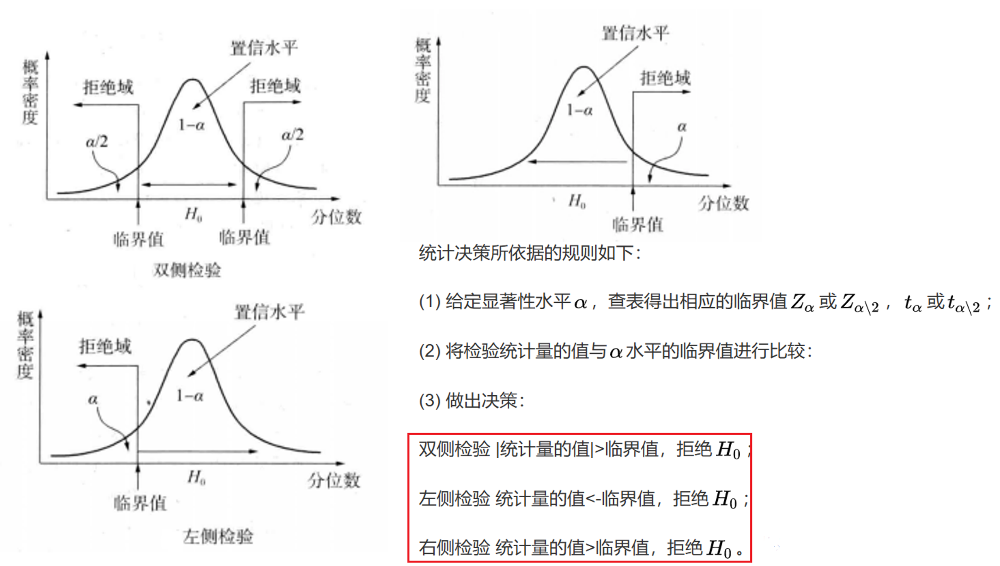

# 9.15

## Exercise

### part1

Example 2: Height of Males
It’s assumed that the mean height of males in a certain city is 68 inches. However, an independent researcher believes the true mean height is greater than 68 inches. To test this, he goes out and collects the height of 50 males in the city.

***how do you  write the null and alternative hypotheses for this scenario?***
$H_0$:$\mu \le 68($the mean height of males in a certain city is equal to or less than 68 inches)
$H_1$:$\mu \gt 68$(the  mean height is greater than 68 inches)

### part2

***What is hypothesis testing and what re the main steps of hypothesis testing?***
Hypothesis testing is a formal procedure for investigating our ideas about the world using statistics. It is most often used by scientists to test specific predictions, called hypotheses, that arise from theories.

**There are 5 main steps in hypothesis testing:**
- State your null hypothesis and alternative hypothesis ($H_0$) and ($H_a$ or $H_1$)
- Collect data in a way designed to test the hypothesis
- Perform an appropriate statistical test
- Decide whether to reject or fail to reject your null hypothesis
- Present your findings and discussion section

***Describe the five steps according to your own understanding of the process.***

***step1.* State your null hypothesis and alternative hypothesis ($H_0$) and ($H_a$ or $H_1$)**
- It's important to restate a null and alternative hypothesis so that you can test it mathematically.The alternative hypothesis is usually your initial hypothesis that predicts a relationship between variables,so it's the hypothesis which you want to back up or support.The null hypothesis is a prediction of no relationship between the variables you are interested in,it's the hypothesis which you want to reject.

***step2.* Collect data.**
- For a statistical test to be valid,it's important to perform sampling and collect data in a way that is designed to test your hypothesis.Your data should be representative,or you may not make the right statistical inference about the population you are interested in.For example,to test differences in average height between men and women,your sample should have an *equal proportion* of men and women,and cover a variety of socio-economic classes and any other control variables that might influence average height.And you should consider your scope(worldwide?country?)
  
***step3.* Perform an statistical test**
- There are a variety of statistical tests available, but they are all based on the comparison of within-group variance (how spread out the data is within a category) versus between-group variance (how different the categories are from one another).

- If the between-group variance is large enough that there is little or no overlap between groups, then your statistical test will reflect that by showing a low p-value. This means it is unlikely that the differences between these groups came about by chance.

***step4.* Decide whether to reject or fail to reject your null hypothesis**
- Based on the outcome of your statistical test, you will have to decide whether to reject or fail to reject your null hypothesis.

- In most cases you will use the p-value generated by your statistical test to guide your decision. And in most cases, your predetermined level of significance for rejecting the null hypothesis will be 0.05 – that is, when there is a less than 5% chance that you would see these results if the null hypothesis were true.

level of significance 显著性水平
significance test 显著性检验
confidence interval 置信区间
拒绝域亦称否定域，又称临界域，是统计学的基本概念之一。指在假设检验中，据以拒绝原假设的统计量的取值范围，假设检验中根据检验统计量的分布，由给定的小概率α(0<α<1)作为显著性水平所确定的拒绝原假设H0的区间称为拒绝域，即统计量在其中取值的概率为α的区域。

***step5.* Present your findings and discussion section**
- The results of hypothesis testing will be presented in the results and discussion sections of your research paper, dissertation or thesis.

- In the results section you should give a brief summary of the data and a summary of the results of your statistical test (for example, the estimated difference between group means and associated p-value). In the discussion, you can discuss whether your initial hypothesis was supported by your results or not.

***Can data be not representative of the population? Why***
No.For a statistical test to be valid, it is important to perform sampling and collect data in a way that is designed to test your hypothesis. **If your data are not representative, then you cannot make statistical inferences about the population you are interested in.**
