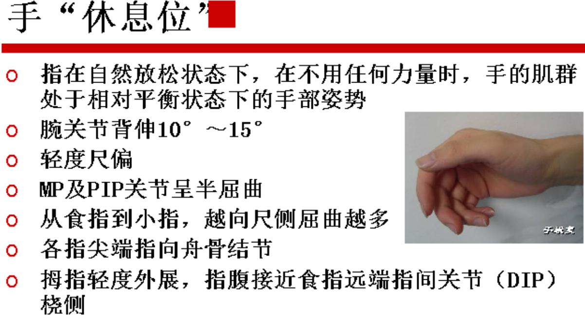
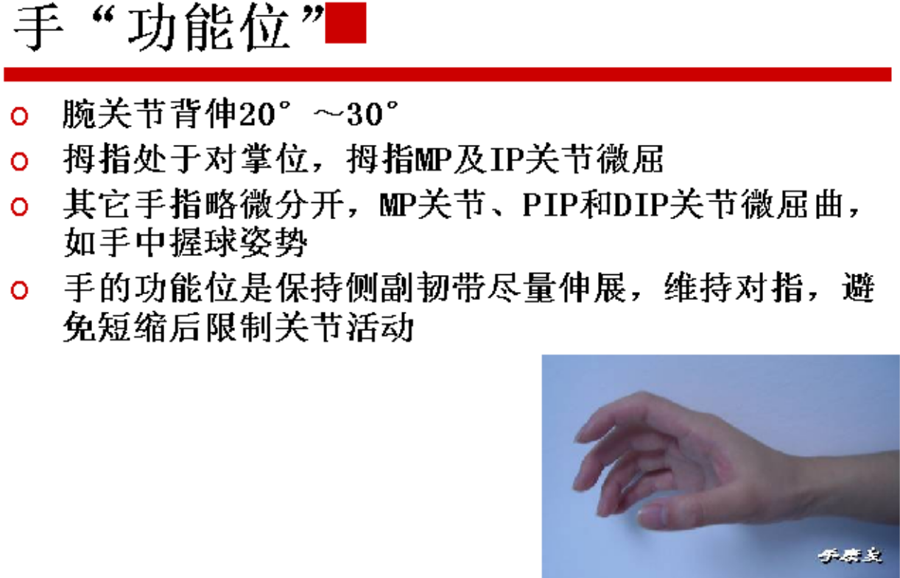
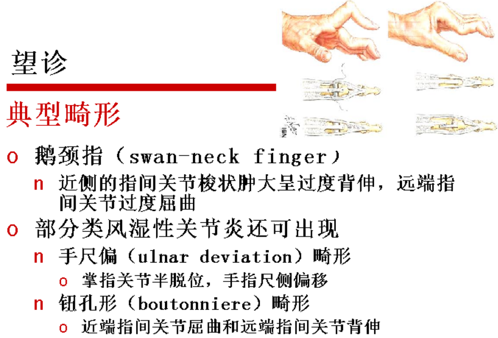
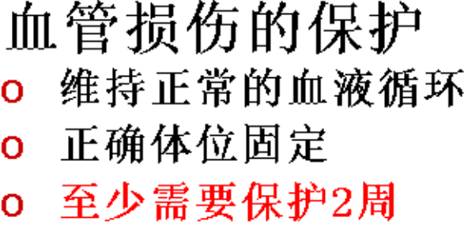
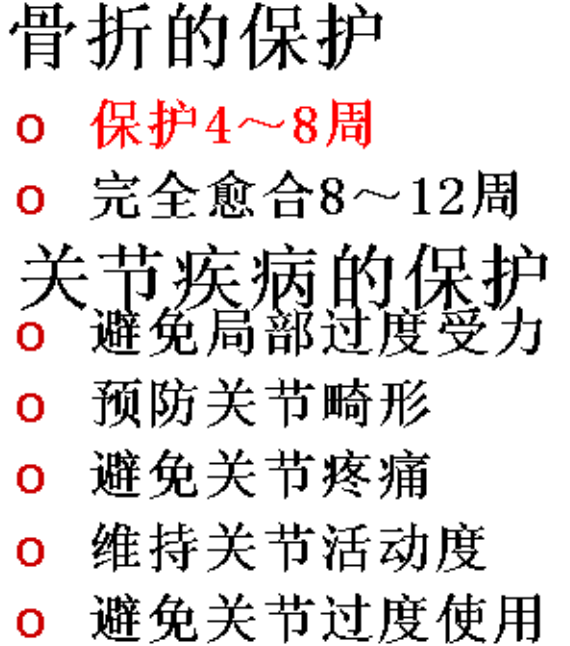
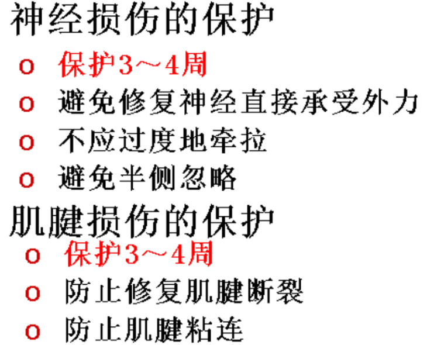
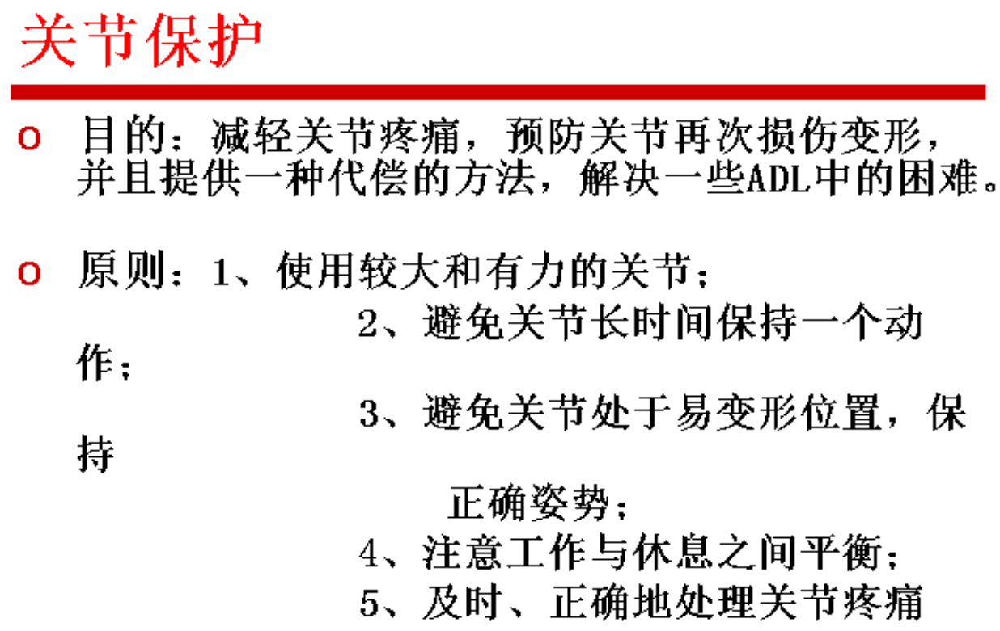
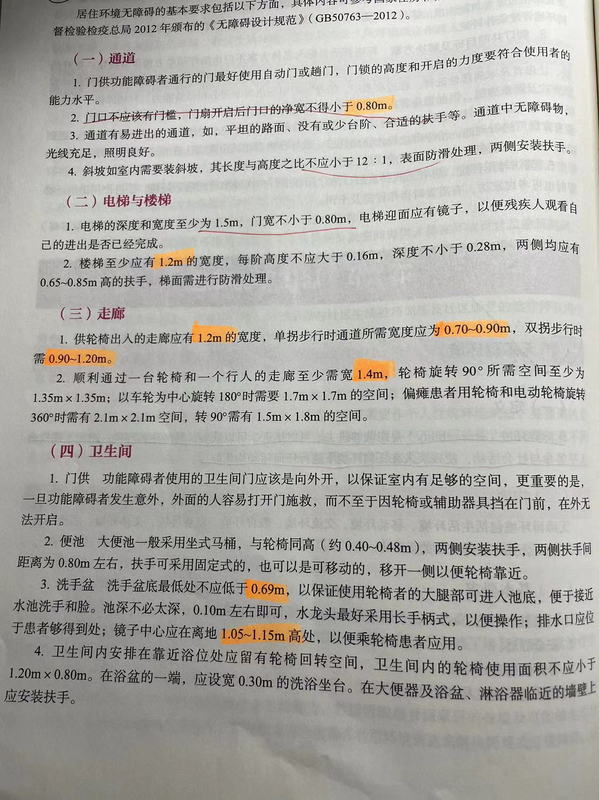
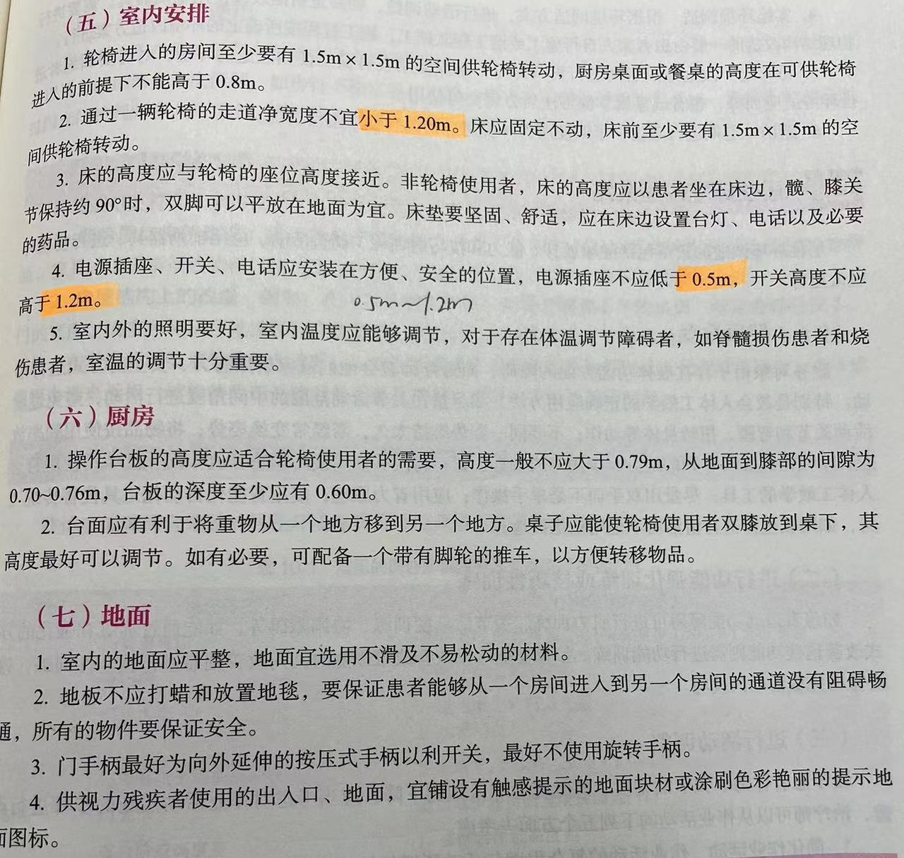
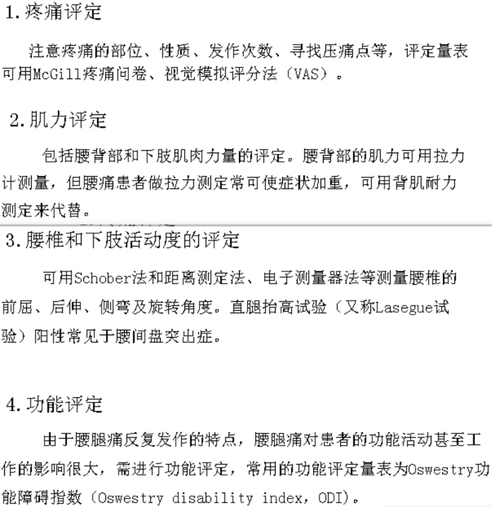

# 复习

## 第一章 作业治疗概论

作业治疗：是康复医学的重要组成部分，是一个相对独立的康复治疗作业。其目的是协助残疾者和患者选择(choose)、参与(engagement)、应用(apply)有目的性和有意义的活动，预防、恢复或减少与生活有关的功能障碍（自理、工作、游戏/休闲）；及促进最大程度的功能。以达到最大限度地恢复躯体、心理和社会方面的适应及功能，增进健康，预防能力的丧失及残疾的发生，使人可以在生活环境中得以发展，和鼓励他们参与并贡献社会。

作业层次：

|角色|在已有期望、责任和权力的社会中的角色及位置|例如父母，照顾者|
|---|---|---|
|活动|通常是指有目标及指定的工作，对参与者是有意义，并且与多项任务有关|例如购物|
|任务|具有共同目的和行动的结合，对参与者是有意义的|例如书写一张去食品店的购物清单|
|行动|可认识的及看得见的行为|例如触摸，行走，站立|
|能力/技巧|支持作业表现的一般特性或者个人的特性|例如空间感知能力，分析推理能力，手操作技巧等|

作业治疗的实践模式：
实践模式作为作业治疗的蓝本，包含作业治疗的根本目标，关注的作业范围，及治疗活动的基本组成部分。常见的有**作业表现模式**、**人类作业模式**、及**人-环境-作业模式**。

作业治疗过程（六个步骤）：
1. 评定
2. 设定预期目标
3. 制定治疗方案
4. 治疗的实施
5. 再评定
6. 决定康复后的去向

## 第二章 作业治疗评定

作业评定是作业治疗的**前提**。作业治疗评定是一个系统收集那些影响人们表现的信息过程，通过评定，治疗师可以发现患者的作业表现障碍、分析障碍的原因、确定治疗目标及指导作业治疗方案的形成。
与临床医学诊断有所不同，作业治疗评定的着眼点不是疾病学，而是着眼于患者的**功能障碍**，它要掌握患者的全身状态及心理状态，以各种方法判明患者的残存功能及恢复能力，并判明妨碍恢复的因素。同时，作业治疗评定与物理治疗等其他治疗评定也有所不同，作业治疗评定更强调患者的**整体**状况，尤其强调患者的日常生活、工作和娱乐等的独立活动状况。

作业表现：指个体从事某项作业活动时的表现，是作业治疗的根本目标，其涉及的范围包括与个体相关的所有作业活动。

活动分析：是指对一个特定的活动在一般典型情况下的分析，包括完成该活动所需要的技能和能力（活动需求）以及在社会文化层面潜在的意义。这种分析是从**活动本身**出发，并不考虑某个人具体所处的环境以及个人因素。

作业活动分析：是指分析一个人在实际环境中想要做或需要做的作业活动的表现，是考察患者实际作业表现与作业活动需求与环境之间的动态关系的过程。这种分析与活动分析最大的不同点在于以**患者**为中心，考虑到个人生活经验、价值、兴趣以及目标，将具体一个人的实际身体功能和身体结构是否符合作业活动的需求，并将实际的环境因素考虑其中。

活动合成：是指治疗师修改一般的活动以达到特定的治疗目标的过程。活动合成的方法包括分级和调适/改良。

## 第三章 日常生活活动训练

日常生活活动：是指人们为了维持生命及适应生存环境而每天都要进行的活动，是自我照顾和生活独立程度的重要指标。
日常生活活动分为基础性日常生活活动和工具性日常生活活动。
基本性日常生活活动也称躯体性日常生活活动，是指为了达到自我身体的照顾而必须每天完成的活动。
工具性日常生活活动是指在家中或社区环境中的日常生活活动，通常需要更复杂的技能，与环境的互动更多。

日常生活活动的介入途径（5种）：
创造/促进、预防、维持、建立/恢复、改良/代偿

## 第四章

治疗性作业活动：是指经过精心选择、具有针对性的作业活动，其目的是维持和提高患者的功能、预防功能障碍或残疾加重。

## 第六章

手功能康复原则P121~122

手功能康复介入时机：早期、中期、后期康复
**早期康复：**
- 是指损伤或术后至**第三周**
- 从损伤或术后第三天开始，作业治疗师可以介入进行手康复
- 目标：
    关节制动
    减轻疼痛
    减轻肿胀
    促进创面愈合
    防止并发症
    避免不合理用力
    维持关节活动范围
    维持软组织柔韧性

**中期康复：**
- 指损伤或术后**第3周至第9周**
- 目标：（最大限度恢复肢体功能）
    改善疲痕
    维持软组织和关节的活动性
    增加肌力
    改善灵巧性和协调性
  
**后期康复：**
- 指损伤或术后**第9周以后**
- 补偿适应：
    增强替代肌群的肌力
    感觉再教育
    预防畸形
    环境干预
    辅助器具的训练使用
    非利手替代训练
    习惯行为矫治等

感觉重塑训练包括：感觉再教育、脱敏技术

感觉再教育：是发展中枢感知能力和重塑感觉准确性的一种技术，可以降低感觉阈值，提高患者对物体的感知能力。感觉再教育四阶段：感知、分辨、记忆、回忆。

脱敏技术：又称感觉抑制法，是降低感觉敏感程度的一种技术，主要是通过反复、系统的训练，提高患者感觉阈值，从而达到降低异常感觉敏感程度的目的。

保护：

## 第十章

### 第二节 居住环境调适

无障碍环境：是指能够进去、可以接近、可以获得、易到达的环境。指为实现残疾人平等参与社会活动，使残疾人在任何环境下进行任何活动均无障碍。

## 第十二章

### 第二节 脊髓损伤

脊髓损伤：是由于各种不同伤病因素引起的脊髓结构/功能损害，造成损伤水平以下运动，感觉，自主功能的改变。

其他看书P276

### 第三节 周围神经损伤

周围神经损伤：是周围运动、感觉和自主神经由于外伤、感染、受压、中毒、缺血和营养代谢障碍而形成的各种类型、各种程度的损伤和疾病。
分为三类：①神经失用；②神经断裂；③轴突断裂

作业评定：
（一）神经干叩击试验
Tinal征
（二）感觉恢复的测试
1. 两点辨别觉
2. 皱纹试验：将患者的手浸泡在42.2度的清水中30分钟，直到出现皱纹。

作业治疗：
1. 急性期（伤后0~3周）
康复目的：消炎，消肿，镇痛，促进损伤愈合，保护修复后的神经。
2. 恢复期（伤后3~6周）
康复目的：预防粘连、挛缩和继发畸形，提高神经的抗张力，改善感觉功能。
(1)桡神经损伤：桡神经损伤后伸腕伸指困难困难可使用伸腕伸指动力型矫形器。
(2)正中神经损伤：拇指对掌功能差可使用动力型拇对掌矫形器。
(3)尺神经损伤：伤后掌指关节屈曲困难可使用屈掌指关节动力型矫形器。
3. 后遗症期（6周以后）
康复目的：矫正畸形，增加关节活动范围，肌力、手的灵敏度和协调性，恢复手功能，提高生活质量。
矫正手部关节屈曲受限，关节伸直受限。

## 第十三章

|骨折作业治疗分期|
|---|
|第一期，即炎症反应期也称之为急性期（伤后或手术后1~4周）|
|第二期，恢复期也称之为亚急性期（伤后4~8周）|
|第三期，再塑期也称之为康复后期（伤后8~12周以后）|

P303
日常生活活动：ADL（20分）
1.捡针（指甲捏）2.捡硬币 3.写字（三指捏）4.提（提箱柄，壶柄等重物）5.拿大茶缸（握）6.锤钉子（强力握持）7.上螺丝（中央握持）8.系鞋带（综合细动作）9.扣纽扣（综合细动作）10.开光口瓶（综合强力握持和精细握持）
每项评分：
完成良好 2分
可以完成，动作不太好 1分
不能完成0分

## 第十四章

### 第一节

上髁炎：肱骨外上髁炎、肱骨内上髁炎。
肱骨外上髁炎：网球肘，旋臂屈腕试验（mill征）
肱骨内上髁炎：高尔夫球肘

狭窄性腱鞘炎：
腱鞘炎是腕手部常见的慢性积累性损伤，在超负荷的情况下肌腱在腱鞘里反复滑动、摩擦，导致腱鞘逐渐增厚、狭窄，肌腱水肿等，产生该肌腱的滑动受阻，此为腱鞘炎，又称为狭窄性腱鞘炎。
分类：
1. 桡骨茎突狭窄性腱鞘炎（De Quervain Sydrome）：握拳尺偏试验阳性（Finkelstein征）阳性，PRTEE量表评定
2. 屈指肌腱狭窄性腱鞘炎：好发于拇指、中指和环指，又称“弹响拇/指”“扳机拇/指”。I度：晨僵，局部疼痛及压痛，无弹响指及交锁。II度：局部疼痛，可扪及腱鞘的肿胀及结节，但可独立完成伸屈功能。III度：症状进一步加重，局部结节增大，出现频繁的交锁与弹响，患者需借外力完成屈伸。

### 第三节 类风湿关节炎

类风湿关节炎：是一种对称性、多发性关节滑膜炎为特征的慢性多系统受累的自身免疫病。该病受累关节以手、足等小关节为主，逐渐向上侵犯腕、肘、肩及踝、膝、髋等关节。
关节表现：
1. 晨僵
2. 关节肿胀
3. 关节疼痛及压痛
4. 关节畸形
5. 骨质疏松

关节外表现：
1. 血管炎
2. 肺间质病变和结节样改变
3. 心包炎
4. 胃肠道症状
5. 神经系统病变

作业评定：
1. 疼痛
2. 关节活动度与稳定性
3. 肌力和耐力
4. 步态
5. 功能活动

### 第五节 颈椎病

分类：
1. 颈型：X片没有椎间隙狭窄、最早期颈椎病。
2. 神经根型：臂丛神经牵拉试验阳性。
3. 脊髓型
4. 椎动脉型
5. 交感神经型

作业评定：
（一）躯体功能评定
1. 疼痛评定：可用MacGill疼痛问卷、视觉模拟评分法(VAS)。
2. 颈部关节活动度评定
3. 四肢及躯干肌力评定：MMT，背部肌力可用拉力计测量，手部肌力可用握力计测量。
4. 四肢深浅感觉评定
5. 手功能测试

（二）活动能力评定
改良Barthel指数（MBI）或功能独立性定量表（FIM）评定

（三）家居环境和工作环境

### 第六节 腰腿痛

腰腿痛不是疾病的名称，而是以腰或下背部疼痛以及腿痛为主要特征的一组临床常见的症状综合征，由于腰痛常与腿痛同时存在，习惯上称为腰腿痛。
最大特点：**疼痛和活动受限**

作业评定：

## 第十六章

### 第四节 作业治疗在儿科疾病中的应用

脑性瘫痪简称脑瘫，是一组持续存在的中枢性运动和姿势发育障碍、活动受限症候群，这种症候群是由于发育中的胎儿或婴幼儿脑部非进行性损伤所致。

P385

孤独症谱系障碍：以社会交往和社会交流缺陷以及限制性重复性行为、兴趣和活动两大核心表现为特征，包含孤独症、阿斯伯格症、儿童瓦解性障碍及广泛性发育未分类四种独立障碍。

## 第十七章

### 第四节 跌倒

跌倒是指突发、不自主、非故意的体位改变，倒在地面或比初始位置更低的平面上。

跌倒的预防：
国际公认的伤害预防策略包括五个方面，也称“5E”伤害预防综合策略。
1. 教育预防策略（Educatiion）
2. 环境改善策略（Environment modification）
3. 工程策略（Engineering）
4. 强化执法策略（Enforcement）
5. 评定策略（Evaluation）