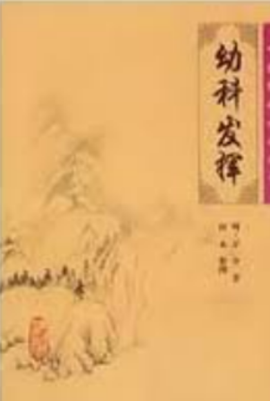

[toc]
# 第一节

## 推拿学

- 在中医和现代科学理论指导下，阐述和研究运用手法和功法防治疾病的方法、规律和原理的一门医学学科。（**考名解！**）

$$
推拿学
\begin{cases}
    推拿学基础✅\\
    推拿练功 \\
    推拿手法✅ \\
    推拿治疗✅ & 
        \begin{cases}
        成人推拿✅ \\
        小儿推拿✅
        \end{cases}\\ 
    推拿医籍选读 \\ 
    实验推拿学 \\ 
    特种推拿 &
        \begin{cases}
        美容推拿 \\
        耳穴推拿 \\
        足穴推拿 \\ 
        手穴推拿 \\
        全息推拿等
        \end{cases}
\end{cases}
$$

## 一、推拿学概论

三个问题：
1. 什么是推拿学？按摩？
2. 推拿名称的演变
3. 推拿与按摩的区别？

1、推拿的定义：
推拿是以中医理论为指导，推拿医生运用推拿手法或借助于一定的推拿工具作用于患者体表的特定部位穴位来防治疾病的一种方法，属于中医外治法范畴。（**考！**）

2、推拿名称的演变：
古称按摩，有按蹻、蹻摩、挢引、案扤 (音同勿) 等，后随发展阶段不同名称逐渐向按摩推拿演变

3、名称由来大致经历了三个发展时期：汉代以前、汉代至明代、明清时期。
名称演变反映了手法的发展和变化，使推拿手法更接近科学合理，是推拿发展史上一个巨大飞跃。

①汉代以前有关推拿的名称众多，如按摩、蹻摩、挢引、案扤等。
按摩**最早见于《黄帝内经》**（**考！**）

②汉以后至明初，这一时期基本统一称为按摩；
明代著名儿科专家万全所著《幼科发挥》首提推拿第一名（**考！**），而后南方晓儿推拿兴起，先后出版看《小二推拿方脉活婴秘旨全书》、《小儿推拿秘诀》等著作，按摩的名称逐渐被推拿所替代。

- 在张四维的《医门秘旨》（成书于1576年出版时间是公元1582年。（此书国内失传，藏于日本）和万全的《幼科发挥》（成书于万历己卯年，即1579年）中都有推拿一词。（**注：书上写的是《医门秘旨》，所以考试时候选这个**）

### 按摩与推拿的区别

 ③清《厘正按摩要术》：“推拿者，按摩之异名。按摩一法，北人常用之，名谓按摩；南人专治小儿，名曰推拿”。对按摩和推拿进行了区别解释。

### “推拿”之称出现原因：

- 可能是由于封建礼教的束缚，按摩科被官方取缔，此时恰逢小儿推拿的蓬勃兴起，使得本来专指小儿按摩的“推拿”一词，从明代起广泛取代了按摩的概念。

## 二、推拿学发展简史

### 第一节 推拿的起源与形成

1. 推拿起源于劳动。人类本能地以手按压以止血，按摩以消肿止痛。经过漫长的日积月累，逐渐总结出一些原始的推拿方法，而使之称为人们治疗疾病的常用方法之一。
2. 推拿发展历程总结：从先秦、秦、汉、三国时期，魏、晋、南北朝的兴起，到隋、唐时期的鼎盛，宋代取消，明代再兴起，再到清朝的取消，推拿发展坎坷历程凸显。
#### 先秦时期

- 推拿称为主要的治疗和养生保健手段。
- 1. **《五十二病方》**，以“**摩**”法记载最多，也是**最早**的推拿手法。（**考！**）
- 2. 《养生方》是一部以养生为主的方书。
- 3. 《引书》是一部导引术专著。
- 4. 《周礼注疏》记载了战国时期名医扁鹊运用推拿等方法成功抢救了尸厥病人一事。

#### 秦汉时期

- 医学著作较完整地记载了推拿防治疾病的方法。
- 1. 我国**最早**推拿学专著《黄帝歧伯按摩》十卷（已佚失）**（考！）**
- 2. 《黄帝内经》我国现存**最早**，且比较全面、系统阐述中医学理论体系的古典医学巨著。该书不少关于推拿的记载概括了推拿具有行气、活血、舒筋、通络、镇静、止痛、清热等作用；介绍了推拿治疗的适应症及禁忌症；还提出了对推拿按摩人员的选才与考核标准。（**考！**）
- 3. 张仲景《金匮要略》**首次**提出了“**膏摩**”一词。（**考！**）（**考！**）
- 膏摩（名解）：膏摩是将药煎成膏剂，涂在患处进行按摩。用“寒水”作介质进行推，以药膏作介质进行摩，起到两者协作相辅相成的作用。（**考！**）
- 4. 华佗——发明了“麻沸散”和施行外科手术，发明了“五禽戏”导引法。

##### 《黄帝内经》对推拿学的贡献
1. 《内经》指出了我国推拿发源地在我国中央地区，即河南洛阳一带。
《素问 - 异法方宜论》中: “中央者, 其地平以湿, 天地所以生万物也众, 其民屓杂而不劳, 故其病多瘄、厥、寒、热, 其治宜导引按蹻。故导引按蹻者, 亦从中央出也。”
2. 将推拿手法，运用到切诊中，以加强疾病诊断的准确性。如按、切、抚、摸等手法。

- 秦汉时期既是推拿独特治疗体系的形成时期，也是推拿发展史上第一个承前启后的鼎盛时期。
- 我国第一部推拿专著——《黄帝歧伯按摩》以养生为主，将推拿作为主要的保健方法。

- 3. 东汉张仲景《金匮要略》
- **首次**提出了“膏摩”一词。（**考！**）
- 该书第一次记述了救治自缢的人工呼吸法，而这种方法可以说就是一种以推拿为主的治疗方法。

#### 两晋南北朝时期
- 已有推拿用于抢救的记载。
- 1. 葛洪《肘后备急方》记载推拿治疗卒心痛方、卒腹痛方，最早的**捏脊法**。
- 葛洪十分重视膏摩的运用，是第一位系统论述膏摩，使膏摩证、法、方、药齐备的医家。
- 捏脊法（名解）：用拇指桡侧缘顶住皮肤，食、中指前按，两指同时用力捏起皮肤，或食指屈曲，用食指中节桡侧顶住皮肤，拇指前按，两指同时用力捏起皮肤，双手交替捻动，自腰骶部捏至胸背部。（**考！**）
- 2. 《肘后救卒方》**首次**对汉代以前已经出现的**膏摩方**作了系统总结。

#### 隋唐时期

- 隋太医署首次设立了按摩博士。
- 唐开始了有组织的推拿教学 : 设立了按摩科，将推拿医生分为按摩博士，按隆师和按摩工。按摩博士在按摩师和按摩工的辅助下，教按摩生“导引之法以除疾、损伤折跌者正之。
- 自我推拿在这一时期得到了广泛的重视:孙思邈《千金方》、巢元方《诸病源候论》。自我推拿的广泛开展，说明推拿疗法开始注重预防保健，注意发挥病人与疾病作斗争的主观能动性。
- 推拿治疗范围也逐渐扩大，如《唐六典》说推拿可除八疾，即风、寒、暑、湿、饥、饱、劳、逸。
-推拿也正是这一时期传入朝鲜、口本、印度、阿拉伯及欧洲。

#### 宋金元时期

- 宋太医局取消了隋唐时期以来近400年的按摩科设置，推拿医学在经历了隋唐时期的高潮后暂时走入低谷。
- 宋代名医庞安时用按摩法催产获得“十愈八九”的效果。
- 膏摩疗法又有了新的发展
《太平圣惠方》记载了六首治疗目疾的摩顶膏，为膏摩治疗眼病的最早记载，该书还首次记载了摩腰膏，是历代医书中记载膏摩方最多的医书，对后世膏摩发展影响巨大。
- 张从正《儒门事亲》中将按摩列为汗法之一，是超越前人的独特见解。
- 元代名医危亦林《世医得效方》记载了利用身体的重力牵引复位的各种方

#### 明代

- 三个特点:一是在国家最高医学教育及医疗机构太医院中设立按摩科，使推拿成为医术十三科之一;二是“按摩”之名开始有“推拿”之称;三是形成了小儿推拿的独特体系。
- 明代前半期是推拿医学的又一高潮期。明代初期，太医院重启诏制，重设按摩科为医学十三科之一。明代隆庆五年(公元1571年)。大医院改组，由十三科并为十一科，按摩科和祝由科同时被撤销。

#### 清代

清代推拿成就主要体现在三个方面：一是推拿在儿科杂病临床应用上的发展；二是以骨伤科疾病为对象的正骨推拿已形成其相对独立的学科体系。以《医宗金鉴》“正骨八法”为代表的骨伤类手法在正骨科中确立了地位，总结出正骨八法为“摸、接、端、提、按、摩、推、拿”。三是作为中医外治法之一的推拿，与其他外治法和药物疗法，在临床应用中相互补充，相互结合。

#### 民国时期

- 存在于民间，发展于民间。
- 由于当时的卫生政策不重视中医，尤其不重视以手法操作为主的中医医疗技术，推拿只能以分散的形式在民间存在和发展。这种发展的方式，其缺陷是受地域之限，缺乏交流;其优势是由于我国疆域辽阔，植根于民间，易顺应该地域流行病的特点和民间要求，发展为各具特色的推拿学术流派。(书中7-9页)
- 是推拿发展史上承上启下，形成流派的关键阶段，这些流派包括一指禅推拿、经络脏腑推拿，点穴推拿，腹诊推拿，内功推拿，滚法推拿，胃病推拿等。
- 1933年出版的黄汉如著《黄氏医话》是目前见到的第一本。

#### 新中国成立后

- 推拿的临床、教学、科研、推拿著作的出版和推拿队伍的建设都出现了空前繁荣的景象。
- 1956年上海成立了我国第1所推拿专科学校——上海中医学院附属推拿学校。
- 1958年上海建立了国内第1所中医推拿门诊部。
- 1997年上海首次招收推拿学专业博士研究生。

#### 纵观推拿学发展史

- 推拿成为一门相对独立的学科是萌芽于明清，形成于20世纪60年代至80年代，之后才继续发展壮大。目前推拿在治疗疾病时，所运用的临床思维方法和诊断治疗理论出现了一种多元化的现象，中医脏腑、经络理论与现代解剖学、生理学、病理学相结合。
  
# 第二节

## 一、疏通经络，调和气血
经络是经脉和络脉的总称，是人体联络、运输和传导的体系。
“经脉者决死生，处百病，调虚实，不可不通”
推拿通过推穴道、走经络而使经络通畅，通过消除肿胀而解除其对经络的压迫，通过缓急解痉而使经脉得以伸展，都能有效地消除瘀血。

## 二、理筋整复，滑利关节

- **理筋整复是推拿治疗伤筋的特色所在。**
- 所谓筋断、筋走、筋翻、筋转等都是筋离开了正常位置，都是筋出巢。理筋整复就是针对筋出巢和骨错缝而设，即纠正筋、骨的解剖位置异常。
- 当损伤发生以后，医者于损伤部位，通过细心触摸，了解病损部位的形态、位置变化等，以确定损伤的性质，再确定伤筋的治疗措施。
- 一旦伤筋，由于患者无法忍受疼痛，其肢体多处于强迫体位;也因为神经的保护性反射，机体软组织处于紧张痉挛状态，肢体关节的活动度也会减小。如果失治或误治，长此以往，在痉挛处形成粘连，将进一步影响肢体关节活动，轻者仅“关节不利”，重者完全冻结、畸形,或“痿废不用”。

## 三、调整脏腑功能，增强免疫能力

- “正气存内，邪不可干”，“邪之所凑其气必虚”。
- 疾病的发生、发展及其转归的全过程，是正气和邪气相互斗争、盛衰消长的结果。

# 总结

1. 概论:两个概念: 推拿学，推拿
2. 发展简史:各时期代表性人物和著作
3. 推拿作用原理和治疗原则