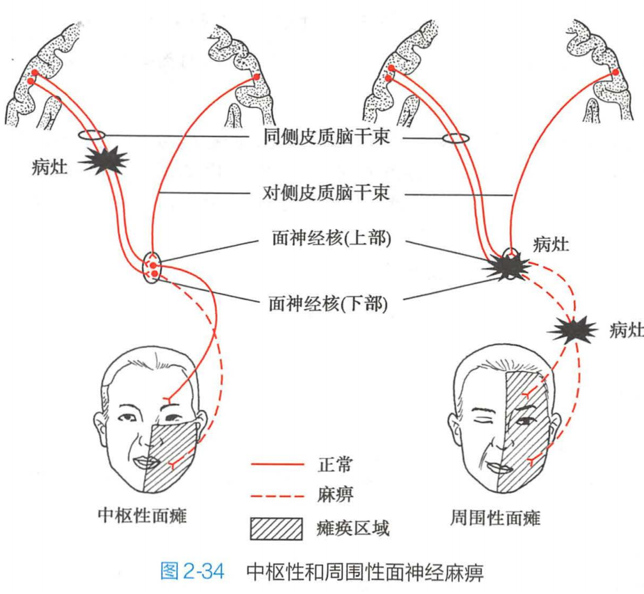
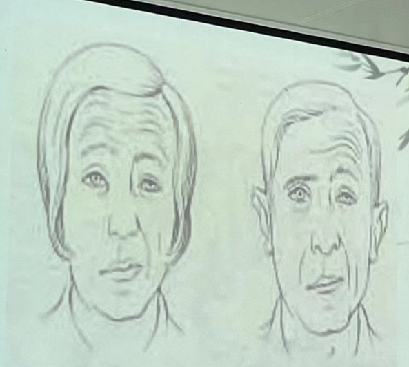
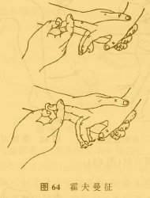
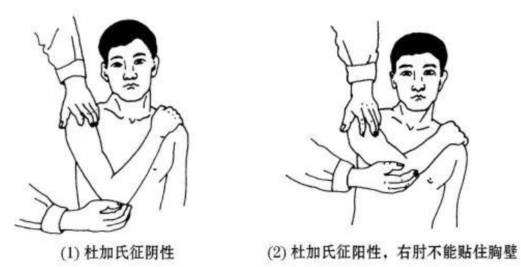
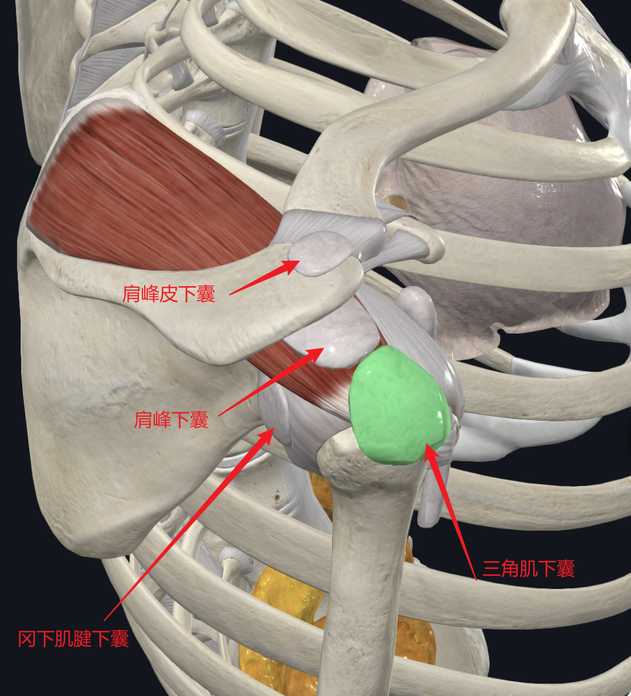
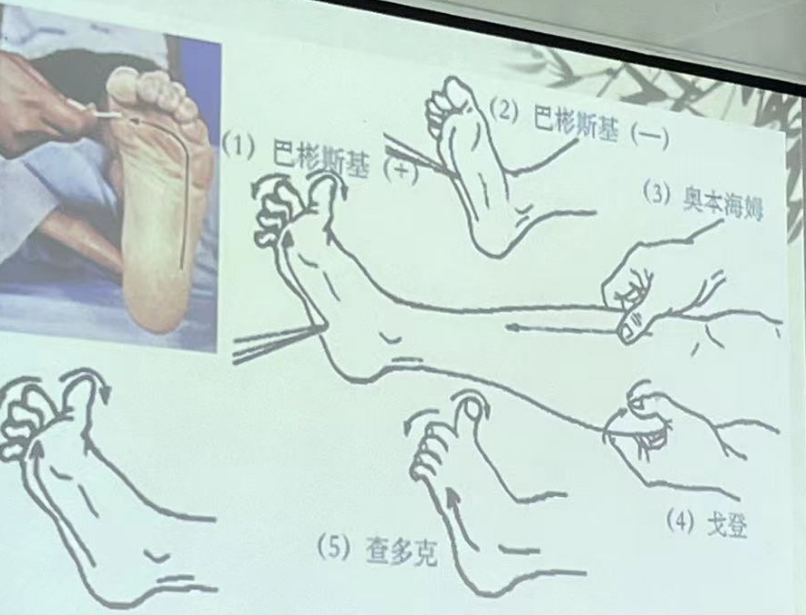

[toc]
# 第二节 常用的诊断方法

[教学内容]
第一节 脊柱部的检查
第二节 四肢部的检查
第三节 胸腹部的检查
第四节 头面部的检查

1. 一般检查方法：望、闻、问、切（西医为“视、诊、叩、听”）
2. 量诊
3. 特殊查体
4. 辅助检查

特殊检查：
①头面、颈项部
②上肢部
③背腰部
④下肢部
⑤胸腹部

## 头面、颈项部

1. **BELL氏征**:患侧表情肌瘫痪，额纹消失，眼裂变大，不能闭合或闭合不全，鼻唇沟变浅。  

思考: 周围性面瘫与中枢性面瘫的鉴别

可以根据是否有额纹判断是中枢性面瘫还是周围性面瘫

2. **椎间孔挤压试验**：
患者坐位，医者双手进行按压，引起颈部疼痛或放射痛者为阳性。说明颈神经受压。

颈神经根走行分布：
$C_4$不过肩
$C_5$不过腕
$C_6$:拇指、手及前臂桡侧
$C_7$:食指、中指、手臂
$C_8$:小指、无名指及前臂尺侧

1. **椎间孔分离试验**：
患者坐位，医者双手托住下额，并逐渐向上牵引颈椎，以扩大椎间孔，如上肢麻木等症状减轻则为阳性。（原理与椎间孔挤压试验相反）

## 上肢部

1. **臂丛神经牵拉试验**：
患者颈部前驱，医者一手抵住患侧头部，一手握患肢腕部，反方向牵拉，患肢有麻木疼痛为阳性。

2. **霍夫曼征**：
医者用左手轻握被检者腕部，以右手食指及中指轻夹病人中指末端指节，并使腕关节略背屈，各手指轻度屈曲以拇指迅速向下弹刮被检者中指指甲，如拇指内收，其余手指也呈屈曲动作即为阳性。

- 反射中心在$C_7$-$T_1$，经正中神经传导，为腱反射亢进表现，也可见于腱反射活跃的正常人
- 反射：生理反射、病理反射。
- 生理反射：深反射（肌腱和关节的反射），浅反射（刺激皮肤、黏膜、角膜等引起肌肉快速收缩反应）,如腹壁反射、跖反射、肛门反射

3. **搭肩试验**:患者屈肘，手能搭到对侧肩膀的同时，肘部能贴近胸壁为正常，若不能完成上述动作，或仅能完成两动作之一者为阳性，提示肩**关节脱位**可能。

4. **肩关节外展试验**：
患者坐位或立位，患侧上肢伸直下垂，然后缓慢外展上举，观察有无疼痛或活动受限。
①**外展起始即有疼痛**（**重要！** 要知道后面的症状），见于**锁骨、肱骨、肩胛骨骨折；肩关节脱位；肩周炎**。（**考试！**）
②越接近90°越疼痛，可能为肩关节黏连。
③外展时疼痛，上举时减轻或不痛，可能为肩峰下滑囊炎、三角肌下滑囊炎或损伤。（**经常考选择**）
④外展上举在60°-120°时出现疼痛，此外活动反而不痛，可能为冈上肌腱炎或损伤。（**经常考选择**）
⑤外展超过90°以上时，肩峰处有疼痛，可能有肩峰骨折。

5. **冈上肌腱断裂试验**：
患者肩外展，在0°-30°时可以看到患侧三角肌用力收缩，但不能外展上肢，此时医者被动运动超过60°，则患者又能继续主动外展上肢，这一个特定外展障碍为阳性，提示有冈上肌腱的断裂。

## 胸腹部

1. 胸廓挤压试验
患者坐位，医者先一手扶其后背部，从前面推压胸骨部，产生挤压力，如有肋骨骨折，则骨折处出现明显疼痛或骨擦音再进行侧方挤压，双手分别放在胸廓两侧，向中间挤压，如有骨折或胸肋关节脱位，相应位置出现疼痛。

## 下肢部

1. **直腿抬高及加强实验**
患者仰卧，医者一手握患者足部，另一手保持膝关节伸直，对双下肢分别做直腿抬高动作，测定高举时疼痛的范围（抬高肢体与床面的夹角）正常时双下肢可抬高70°以上仅有胭窝部紧张感，而无疼痛，若幅度降低，同时伴下肢放射性疼痛为阳性。如有腰部神经根受压时，可出现直腿抬高明显受限，一般多在60°以下，即出现受压神经根分布区的疼痛，为直腿高腿抬高试验阳性。
注意:①骶髂关节和腰骶关节有病时，直腿抬高试验也能出现阳性。但疼痛部位不同，抬腿的高度也比坐骨神经痛时高。这是因为真腿抬高不仅能牵拉坐骨神经，而且使骶髂关节产生旋转扭力，如果抬高越过90°，还能影响腰骶关节。②股后肌群的紧张也可以引起直腿抬高试验假阳性。

2. **巴宾斯基征**

