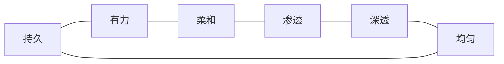
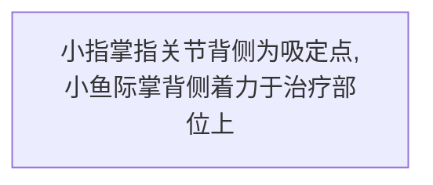

# 第三节 手法

##  总论

1. **概念**：用手或肢体的相关部位，按特定的技巧作用于体表，以达到治病、防病及保健的目的。因其主要用手法进行操作，故称为**手法**。（**考！**）
手法的好坏可以直接影响到治疗的效果，甚至关系到患者的安危。  
“一旦临症，机触于外，巧生于内，手随心转，法从手出。”

2. 基本要求：(**考！6点**)

①**持久**：手法按要求作用一定的时间
②**有力**：手法要有一定的力度，达到一定的层次。（根据病人体质、病情选择力量）
③**均匀**：手法的力量、速度、幅度要均匀。
④**柔和**：手法要轻柔和缓，不宜用蛮力、暴力，做到力量轻而不浮、重而不滞。
⑤**深透**：手法作用于人体后即有“力达病所”的力透感，治疗后施术部位的浅层和深层均得到充分的放松。
⑥**渗透**：一些手法产生的效果是从浅层渗透到深层组织。例如：使擦法产生的热逐渐渗透到深层组织，可称为渗透。

3. 其他要求：（**考！三点，可能要展开**）

①形体：
体松:即身体放松，首先精神放松，以保证**沉肩、垂肘**，肘及上臂放松，以保证肘及腕关节能自由屈伸；下肢放松以保证下肢的稳定与放松。（放松并不等于注意力不集中，肢体懈怠）（松而不懈，紧而不僵）
体正:

②呼吸:
手法操作中，身体要自然呼吸，不憋气“静、缓、深、匀”，以保证连续、持久的操作手法。
△“静”：呼吸平静，呼吸动作不宜过大；
△“缓”：呼吸缓慢，不宜太快；
△“深”：呼吸要深沉，气达丹田；
△“匀”：呼吸要均匀。
呼吸的频率要与用力、快慢相适应。

③用力：
△以近代远：用力时以近端带动远端。
△刚柔并济：在施用以刚为主的手法时，患者应感到力量很大但能忍受；施用以柔为主的手法时，患者应感到很舒适但有一定的力度。
△整体用力：施用手法时，推拿医生“心有所想，法有所施”，身体各部协同运动发力。手法之力起于跟（足或丹田），顺于中（下肢、腰、上肢），发于梢（掌、指）。切忌以掌着力时发于掌，以指着力时出于指。

4. 手法的作用与分类
作用：缓解肌肉痉挛、放松止痛、活血祛瘀、消除肿胀、温经通络、疏通狭窄、分解黏连、滑利关节、整复错位。

按手法动作形态进行分类
△摆动类：有摆动特点的手法，常用的有：一指禅推法、滚法、揉法等。
△摩擦类：有与体表间有相互摩擦特点的手法，常用的有：摩法、擦法，推法、搓法、抹法、刮法等。
△挤压类有与固体表面相互挤压特点的手法，常用的有：按法、点法、拿法、捏法等。
△叩击类 有叩击特点的手法，常用的有：击法、拍法、弹法、鸣天鼓。
△振动类：有振动特点的手法，常用的有：振法、抖法。
△运动关节类：可以使关节产生运动的手法，常用的有：摇法、背法、拔伸类、扳法、屈伸法。

## 各论

### 摆动类手法

以指、掌、腕关节作协调的连续的摆动,称摆动类手法。
本类手法包括一指禅推法、㨰法和揉法。

#### 1.㨰法

**概念**：以手背部小指侧着力，通过前臂的旋转和腕关节的屈伸运动，在施术部位持续不断的来回滚动，称为㨰法。（滚法推拿流派的代表方法）（**考！** **重点**）

**操作**：**沉肩、垂肘**，以小指掌指关节背侧**吸定于**施术部位，手背部小指侧作用于施术部位，肘关节微屈并放松，腕关节放松，前臂摆动，带动前臂旋转和腕关节屈伸的**复合运动**，使产生的力持续作用于治疗部位上，频率为120-160次/min。

（一）动作要领

肩部不要耸起用力，肩部下垂。

前臂肌肉放松，肘部自然屈曲120~140°。

手腕自然屈曲。腕关节部放松。

动作要领：
1. 手法吸定部位要紧贴体表,不能拖动、辗动或跳动。
2. 侧滚法上肢放松,肘关节微屈,立滚法肘关节伸直。
3. 着力部位似球形或瓶形。
4. 侧滚法滚动幅度在120°左右，腕关节屈曲时，向外滚动80°，伸直时，向内滚动40°;立滚法滚动幅度在45°左右。
5. 前臂的旋转和腕关节的屈伸要协调一致。

**分类**

△**侧滚法**：用手背近小指侧着力于施术部位，以掌指关节为吸定点。
△**立滚法**：用小指、无名指、中指背侧及掌指关节着力于施术部位。