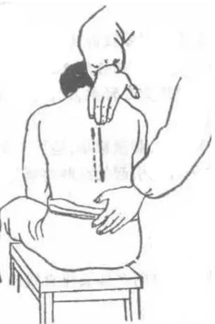

# 第三节 手法

##  总论

1. **概念**：用手或肢体的相关部位，按特定的技巧作用于体表，以达到治病、防病及保健的目的。因其主要用手进行操作，故称为**手法**。（**考！**）
手法的好坏可以直接影响到治疗的效果，甚至关系到患者的安危。  
“一旦临症，机触于外，巧生于内，手随心转，法从手出。”

2. 基本要求：(**考！6点**)

①**持久**：手法按要求作用一定的时间。
②**有力**：手法要有一定的力度，达到一定的层次。（根据病人体质、病情选择力量）
③**均匀**：手法的力量、速度、幅度要均匀。
④**柔和**：手法要轻柔和缓，不宜用蛮力、暴力，做到力量轻而不浮、重而不滞。
⑤**深透**：手法作用于人体后即有“力达病所”的力透感，治疗后施术部位的浅层和深层均得到充分的放松。
⑥**渗透**：一些手法产生的效果是从浅层渗透到深层组织。例如：使擦法产生的热逐渐渗透到深层组织，可称为渗透。

3. 其他要求：（**考！三点，可能要展开**）

①形体：
体松:即身体放松，首先精神放松，以保证**沉肩、垂肘**，肘及上臂放松，以保证肘及腕关节能自由屈伸；下肢放松以保证下肢的稳定与放松。（放松并不等于注意力不集中，肢体懈怠）（松而不懈，紧而不僵）
体正:
身体正直，手法操作中，身体要保持正直；头正、颈直、含胸、拔背、塌腰、敛臀以保证身体正直。

②呼吸:
手法操作中，身体要自然呼吸，不憋气“静、缓、深、匀”，以保证连续、持久的操作手法。
△“静”：呼吸平静，呼吸动作不宜过大；
△“缓”：呼吸缓慢，不宜太快；
△“深”：呼吸要深沉，气达丹田；
△“匀”：呼吸要均匀。
呼吸的频率要与用力、快慢相适应。

③用力：
△以近代远：用力时以近端带动远端。
△刚柔并济：在施用以刚为主的手法时，患者应感到力量很大但能忍受；施用以柔为主的手法时，患者应感到很舒适但有一定的力度。
△整体用力：施用手法时，推拿医生“心有所想，法有所施”，身体各部协同运动发力。手法之力起于跟（足或丹田），顺于中（下肢、腰、上肢），发于梢（掌、指）。切忌以掌着力时发于掌，以指着力时出于指。

4. 手法的作用与分类
作用：缓解肌肉痉挛、放松止痛、活血祛瘀、消除肿胀、温经通络、疏通狭窄、分解黏连、滑利关节、整复错位。

按手法动作形态进行分类（**考！**）
△摆动类：有摆动特点的手法，常用的有：一指禅推法、滚法、揉法等。
△摩擦类：有与体表间有相互摩擦特点的手法，常用的有：摩法、擦法，推法、搓法、抹法、刮法等。
△挤压类：有与固体表面相互挤压特点的手法，常用的有：按法、点法、拿法、捏法等。
△叩击类：有叩击特点的手法，常用的有：击法、拍法、弹法、鸣天鼓。
△振动类：有振动特点的手法，常用的有：振法、抖法。
△运动关节类：可以使关节产生运动的手法，常用的有：摇法、背法、拔伸类、扳法、屈伸法。

## 各论

### 第一节 摆动类手法

以指、掌、腕关节作协调的连续的摆动,称摆动类手法。
本类手法包括一指禅推法、㨰法和揉法。

#### 1.㨰法

**概念**：以手背部小指侧着力，通过前臂的旋转和腕关节的屈伸运动，在施术部位持续不断的来回滚动，称为㨰法。（滚法推拿流派的代表方法）（**考！** **重点**）

**操作**：**沉肩、垂肘**，以小指掌指关节背侧**吸定于**施术部位，手背部小指侧作用于施术部位，肘关节微屈并放松，腕关节放松，前臂摆动，带动前臂旋转和腕关节屈伸的**复合运动**，使产生的力持续作用于治疗部位上，频率为120-160次/min。

（一）动作要领

肩部不要耸起用力，肩部下垂。

前臂肌肉放松，肘部自然屈曲120~140°。

手腕自然屈曲。腕关节部放松。

动作要领：
1. 手法吸定部位要紧贴体表,不能拖动、辗动或跳动。
2. 侧滚法上肢放松,肘关节微屈,立滚法肘关节伸直。
3. 着力部位似球形或瓶形。
4. 侧滚法滚动幅度在120°左右，腕关节屈曲时，向外滚动80°，伸直时，向内滚动40°;立滚法滚动幅度在45°左右。
5. 前臂的旋转和腕关节的屈伸要协调一致。

**分类**

△**侧滚法**：用手背近小指侧着力于施术部位，以掌指关节为吸定点。
△**立滚法**：用小指、无名指、中指背侧及掌指关节着力于施术部位。

#### 2.一指禅推法

**概念**：以拇指着力，通过前臂的运动，带动腕部的往返运动，使所产生的力通过拇指持续的作用于治疗部位，称为一指禅推法。

**操作**：拇指自然伸直，其余手指掌指关节、指间关节自然屈曲，以拇指指端或罗纹面或偏峰着力于施术部位，沉肩、垂肘、悬腕、指实、掌虚，通过前臂摆动，带动腕关节有节律的内外摆动，产生的功力通过拇指，持续的作用于施术部位，频率：120-160次/min。（**考！填空、问答...**）

动作要领：（**考！填空、问答...**）
1. **沉肩**：肩关节放松，肩部自然下垂，不要外展，不要耸肩用力。
2. **垂肘**：肘部自然下垂，肘关节不要向外支起，亦不要过度加紧内收。
3. **悬腕**：腕关节自然区屈曲。
4. **指实**：着力部位要吸定在施术部位。
5. **掌虚**：手握成空拳，四指及掌部均应放松。
6. **紧推慢移**:紧推是指腕部的摆动频率要快，120-160次/min；慢移是指拇指在施术部位的移动速度要慢，指下不可出现滑动或摩擦。
7. **蓄力于掌，发力于指**：手法的力量从掌而发，通过手指作用于施术部位。

#### 3.揉法

**概念**：以手掌大鱼际、掌跟、手指螺纹面等部位着力，吸定于体表施术部位，带动皮肤、皮下组织一起做轻柔和缓的环旋动作，称为揉法。（**考！**）

**操作**：

1. 指揉法
2. 掌揉法
3. 鱼际揉法
4. 掌跟揉法
5. 前臂揉法

**指揉法：**

（1）用手指罗纹面吸定于一定部位或穴位上，常用的有拇指揉；中指揉；食、中、无名三指揉等。
（2）腕部放松。
（3）以肘部为支点，前臂作主动摆动，带动腕和掌指轻柔和缓的揉动。

**掌揉法：**

（1）用手掌大鱼际或掌跟或手掌吸定于一定部位或穴位上。
（2）腕部放松。
（3）以肘部为支点，前臂作主动摆动，带动腕做轻柔的揉动。

**揉法为多种流派的辅助手法**

### 第二节 摩擦类手法

以掌、指或肘贴在体表作直线或环旋移动称摩擦类手法。
本类手法包括摩法、擦法、推法、搓法、抹法等。

#### 1.摩法

应用手指或手掌在患者体表做环形而有节律的轻抚摩动，称为摩法。
可以配以药膏，加强疗效，称为膏摩。

动作要领：

1. 上肢、腕掌要放松。
2. 前臂带动腕部及着力部位做环形运动。
3. 动作要缓和协调。
4. 用力宜轻不宜重，速度宜缓不宜急。

#### 2.擦法

用手指、手掌贴附于体表施术部位做较为快速的直线往返运动，使之摩擦生热，称为擦法。（**考！**）

掌擦法 大鱼际擦法 小鱼际（侧擦法）

**掌擦法：**

（1）掌面紧贴皮肤，手掌自然伸直，手指自然伸开，腕关节伸直或稍背伸，使前臂与手接近相平。
（2）以肩关节为支点，上臂主动，带动手掌作前后或上下往返直线运动。

**大鱼际擦法：**

（1）大鱼际紧贴皮肤，掌指并拢微屈成虚掌，或手指自然伸开。
（2）以肩关节为支点，上臂主动，带动手掌和大鱼际作前后或上下往返直线移动。也可运用肘关节屈伸往返直线移动。

**小鱼际擦法：**

（1）小鱼际部位紧贴皮肤，手指自然伸直，腕关节自然伸直。
（2）以肩关节为支点，上臂主动，带动小鱼际和手指作前后或上下往返直线运动。

- 掌擦法接触面较大，适用于肩背、胸腹等面积较大而又较为平坦的部位，临床上常用以治疗呼吸道疾患，消化道疾患以及体虚乏力等症。
- 大鱼际擦法接触面较掌擦法为小，适用于四肢部，尤以上肢部为多用。常用于治疗四肢伤筋。
- 小鱼际擦法接触面积较小，如操作技术熟练,摩擦后可使局部产生灼热感，如擦腰骶部可使温热透达少腹或至下肢。常用于治疗腰背风湿麻痹。

动作要领:
1. 着力部位要紧贴体表，压力适中，直线往返，距离尽量拉长。
2. 擦法产生的热量以“透热”为度。
3. 不可擦破皮肤，长时间的操作或擦法后又使用了其他手法易致皮肤破损，故应避免。

注意事项：
1. 治疗部位应充分暴露，可使用介质保护皮肤。
2. 压力适中。
3. 本法多用于手法操作的收尾阶段。
4. 注意保暖，防止患者受凉。

#### 3.推法

以指或掌、肘等着力于施术部位上，做单项直线推动，称推法，又名平推法。

推法有指推法，掌推法，肘推法。

动作要领:
1. 着力部位要紧贴体表，压力平稳适中，做到轻而不浮，重而不滞。
2. 单方向直线推进，速度宜缓慢均匀。
3. 依据经络走行及肌纤维方向推动。 

注意事项：
1. 不可使皮肤破损。
2. 力量适中、方向正确。
3. 拇指端推法与拇指平推法距离宜短;其他推法距离宜长。

#### 4.搓法

概念：以双手夹持肢体或以单手、双手着力于施术部位，做快速的交替运动或往返运动，成为搓法。

操作：
以双手掌面夹住治疗部位，嘱患者肢体放松，前臂与上臂部施力，带动双手做相反方向快速搓动。同时沿治疗部位缓慢上下移动。

动作要领:
以上肢部为例：
病人坐势，手臂放松，自然下垂。医者站于一侧，上身略前俯，用双手分别合抱其肩前后部，相对用力作一前一后的交替搓揉，边搓边向指端方向移动，如此往返数次。

动作要领:
1. 双手用力要对称。
2. 搓动要快，移动要慢。
3. 不可憋气。

#### 5.抹法

用单手或双手罗纹面或掌面紧贴皮肤，用力作上下、左右、孤形、曲线或任意往返推动的手法，称为抹法。
抹法，是一指禅推拿流派的辅助手法之一。

### 第四节 挤压类手法

用指、掌或肢体其他部分按压或对称性挤压体表，使之产生挤压感觉，称为挤压类手法。
本类手法包括按、点、捏、拿、捻和踩跷法。

#### 1.按法

以指或手掌着力于体表，逐渐用力下压，为按法。常与揉法相结合。
指按法、掌按法

**1、指按法**
用拇指（指端或指腹）或中指或食中二指或食中无名指三指等按压体表。

**2、掌按法**
用单掌或双掌，或用双手重叠按压体表，手指自然伸开。

动作要领：
1. 用力由轻渐重，渗透至深层组织。
2. 垂直下压，缓慢而有节奏。
3. 着力部位紧贴体表，不要移动。
4. 不可突施暴力。

注意事项：
1. 诊断明确，掌握患者骨质情况。
2. 用力由轻到重，切忌突发突止，暴起暴落。
3. 可结合揉法，有按一揉三的说法。
4. 协调用力。
5. 患者俯卧位，避免损伤。

#### 2.点法

以指端或关节突起部按点按治疗部位，称为点法。
指端点法、屈指点法、肘点法
点法着力部位小、刺激强、操作省力等特点。

动作要领：
1. 吸定于施术部位，由轻到重、平稳持续的用力。
2. 避免手指过伸或过屈。

**动作要领**
1、拇指点：
手握空拳，拇指伸直，用**指端**点按某一穴位。
2、屈指点：
屈拇指点：手握空拳，用拇指指间关节桡侧点压体表。
屈食指点：手握空拳，用食指近侧指间关节点压体表。

#### 3.捏法

用拇指和食指或其他指对称，夹住肢体相对用力挤捏并逐渐移动，称为捏法。
有三指捏及五指捏两种。

(一)动作要领:
1. 三指捏是用大拇指与食中二指夹住某些部位或肢体，相对用力挤压。
2. 五指捏是指用大拇指与其余四指夹住肢体，相对用力挤。

(二)操作要求:
在作相对挤压动作时，要循序而下，均匀而有节律。

(三)临床应用:
本法具有舒经通络，行气活血的作用。用于头部、颈项部、四肢脊背等。

#### 4.拿法

概念：拇指与其余手指相对用力，提捏或揉捏肌肤或肢体，称为拿法。根据拇指与其他手指配合的多寡有三指拿法、五指拿法等称谓。拿法可单手操作，亦可双手同时操作。
（临床以“刚”为多，刺激量较大时，每次每个部位操作时间不宜过长）

用大拇指或食中二指，或大拇指和其余四指相对用力，在一定的部位和穴位上进行节律性的提捏。