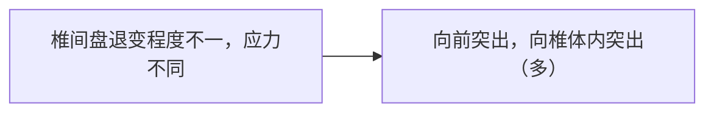
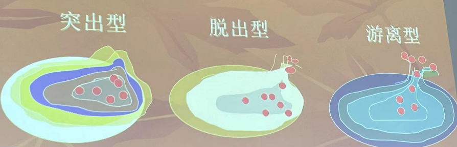

# 治疗

## 腰椎间盘突出症

作业:病案分析
某男，42岁，工人。患者3天前抬重物时突然出现腰痛，以右侧为主并向右下肢放射，难以俯仰，行走困难，休息后未见好转，即来求治查体见脊柱向左侧弯，L4~L5棘突间右侧压痛，按压时有右下肢放射痛，腰肌右侧张力高，右下肢直腿抬高试验30° (+)，加强试验
(+)。

### 一、定义

腰椎间盘突出症，又称“腰椎间盘纤维破裂症”。本病是由于腰椎间盘退行性变，导致髓核脱出纤维环外，刺激或压迫腰脊神经根而引起腰腿疼的一种综合征。
本病好发于30-50岁体力劳动者，临床上以$L_{4-5}$、$L_5-S_1$椎间盘突出多见。

### 二、解剖特点

腰椎间盘上下为上胃椎体下缘和下位椎体上缘形成，周围有纤维环束缚，前有前纵韧带，后有后纵韧带加固，但后纵韧带自第1腰椎平面以下，后纵韧带逐渐变窄，至第5腰椎和第1骶椎间，宽度减少50%。

### 三、病因

$$
内因
\begin{cases}
    解剖结构的因素 \\
    椎间盘的退变和发育上的缺陷
\end{cases}
$$

$$
外因
\begin{cases}
    急慢性损伤 \\
    寒冷刺激
\end{cases}
$$

### 四、病理分型（了解）

1. 突出方向：

2. 突出部位

$$
向后外突出
\begin{cases}
    单侧型：髓核突出和神经根受压只限于一侧 \\
    双侧型：从后纵韧带两侧突出，两侧神经根皆受压 \\
    中央型：正中突出，出现马尾刺激症状
\end{cases}
$$

3. 突出程度：

### 五、临床表现（重点）

1. **腰痛和下肢神经分布区域放射痛**
2. 腰部和/或下肢主观麻木感
3. 腰部和/或下肢温度下降
4. 腰部运动障碍
5. 腰椎姿势改变

### 六、临床体征（重点）

1. 腰部病变椎体周围压痛、叩击痛
2. **直腿抬高及加强试验阳性**
3. **下肢病理征阳性（巴宾斯基征）**
4. 下肢肌力下降

### 七、诊断及鉴别诊断

1. 诊断标准：体征和影像检查结合
2. 鉴别诊断：
腰肌劳损和棘间韧带损伤
腰三横突综合症
脊柱滑脱及椎弓根峡部不连
脊柱肿瘤和脊柱结核
急性腰扭伤（案例分析会考！！）
梨状肌综合症

### 八、治疗

1. 治疗原则：舒筋通络，活血化瘀，松解粘连，理筋整复。
2. 操作：
   （1）患者取俯卧位，医者用㨰、按、揉法施术于患者腰部两侧膀胱经、臀部及下肢，以疼痛点为重点。
   （2）点按肾俞、大肠俞、阿是穴、环跳、委中、承山或居髎、风市、阳陵泉、悬钟。

诊断：
$$ 
诊断
\begin{cases}
    病史 \\
    主诉：腰痛伴下肢放射痛 \\
    症状：腰痛伴下肢放射痛 \\
    体征：直腿抬高试验及加强试验阳性，巴宾斯基征阳性 \\
    辅助检查：MRI,CT \\
\end{cases}
$$