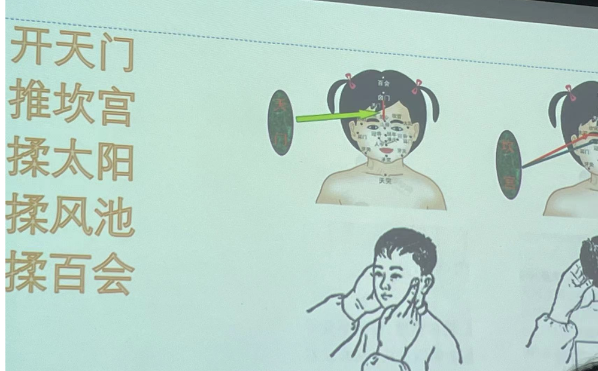

# 治疗

## 失眠

### 一、概念

失眠又称不寐，是指以经常不能获得正常睡眠为特征的一种病症，轻者难以入寐，或睡中易醒，醒后不能再寐，或时寐时醒；重者彻夜不能入寐。

**什么是“失眠症”：**

- 有睡意时，上床30分钟不能入睡
- 觉醒时间每晚超过30分钟
- 且白天有症状
- 在临床上可以诊断为失眠症

### 二、病因病机

1. 心脾两虚：思虑过度，伤及心脉，血液损耗，心神不荣，导致失眠。多表现为多梦易醒，心悸健忘，神疲乏力，面色少华，舌淡苔白，脉细弱。
2. 阴虚火旺：素体虚弱、久病体虚、房劳过度导致肾阴亏损，心肾不交，水火失济，心火独亢，发为失眠。多表现为头晕耳鸣，口干少津，五心烦热，心悸健忘，舌质红，脉细数。
3. 痰热内扰：饮食不节，肠胃受累，宿食内停，酿成痰热，胃气失和，夜卧不安。多表现为心烦口苦，胸胁满闷，舌红苔黄腻，脉滑数。
4. 肝郁化火：恼怒伤肝，肝气淤滞，郁而化火，火性上炎，扰动心神，则夜卧不安。多表现为性情急躁，口渴喜饮，小便黄赤，大便秘结，舌红苔黄，脉弦数。

### 三、诊断

1. 有睡眠障碍病史：入寐困难；寐后易醒、多梦，醒后难以入睡，重者彻夜不寐
2. 伴有头痛、头昏、心悸、焦虑、健忘等病症。
3. 排除其他疾患。

鉴别诊断:

1. 一过性失眠
2. 少眠

### 四、推拿治疗

治则：调节阴阳，宁心安神
操作部位及取穴：头面及颈肩背部；印堂、神庭、太阳、晴明、攒竹、鱼腰、角孙、百会、风池、安眠、心俞、肝俞、脾俞、胃俞、名门等穴。
手法：一指禅推法、抹法、按揉法、扫散法、拿法、滚法、弹拨等手法。

