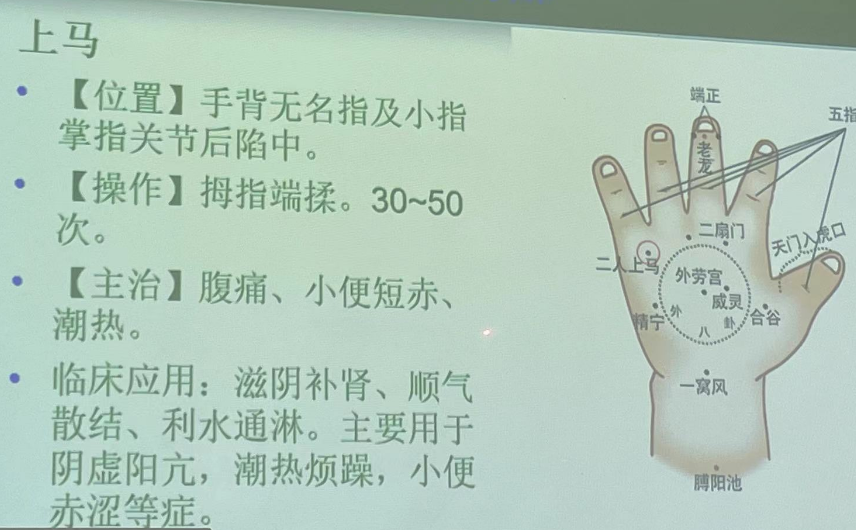

# 小儿推拿

小儿推拿的基本知识
小儿推拿常用手法
小儿推拿常用穴位
小儿常见不适症保健推拿

## 小儿推拿的基本知识

### 小儿推拿的一般知识

一、小儿推拿的优点
不用针，不用药，见效快
1. 经济简便
2. 易于掌握
3. 安全可靠
4. 疗效显著

二、小儿推拿的特点

（一）手法特点
1. 推拿手法的基本特点
（1）推拿八法：按、摩、掐、揉、推、运、搓、摇
（2）基本要求：轻快柔和，平稳着实（**重点！！**）
2. 推拿手法的操作特点
（1）顺序：先头面，次上肢，再胸腹、腰背、最后是下肢。依患儿病情的不同，可灵活掌握。
（2）时间和疗程
（3）治疗量（刺激量）

（二）穴位特点
（1）性状：呈点、线和面状分布
（2）分布：双肘以下，其次为头面、胸腹背，下肢较少。上肢穴位，一般不分男女，习惯上推拿左手（亦可推拿右手）。
（3）小儿推拿常用穴的名称有些与成人名称相同，但位置不同。  
特定穴的配伍特点
（1）主次配穴
（2）经验配穴

（三）治疗特点
1. 以辩证施术为原则
2. 以补虚泻实为重点
（1）轻重补泻
（2）快慢补泻
（3）方向补泻

三、小儿推拿的作用

- 疏通经络，行气活血
- 平衡阴阳，调节脏腑
- 扶正祛邪，防病保健

四、适应症与禁忌症（**考！**）

1. 适应
小儿泄泻、便秘、脱肛、呕吐、腹痛、厌食、感冒、咳嗽、发热、遗尿、肌性斜颈等以及防病保健。

2. 禁忌
溃疡性皮炎、脓肿、骨伤疾患、传染病、先天性心脏病。

五、推拿前的准备及注意事项

1. 环境
2. 患儿姿势
3. 操作多采用患儿左手
4. 操作顺序：头面-上肢-胸腹-下肢-腰背
5. 手法轻而柔和
6. 推拿介质（润滑剂）
7. 每日一次
8. 避风寒

六、小儿推拿常用介质

汁剂——葱白汁、生姜汁、藿香汁、荷叶汁等。
水剂——凉水、金银花浸液、竹叶浸液、薄荷浸液、菊花浸液等。
粉剂——滑石粉等。
油剂——芝麻油、清凉油等
膏剂——冬青膏等。

### 小儿推拿的生理病理特点

一、小儿生理特点

1. 脏腑娇嫩，形气未充
小儿从出生到成年，处于不断生长发育的过程中，无论在解剖、生理、病理、免疫等方面，都与成人有所不同，机体各器官的形态、位置，随着年龄的增长而在不断的变化，其生理功能也都未达到成熟完善，中医把这种现象称为脏腑娇嫩，形气未充。

2. 生机蓬勃，发展迅速
小儿在生长发育过程中：从体格、智力以至脏腑功能，均不断向完善、成熟方面发展，年龄越小，生长发育的速度也越快。反映了小儿生机旺盛，对营养物质的需求相对地更加迫切的特点。

二、小儿病理特点

- 小儿的病理特点主要表现为：
发病容易，传变迅速，脏气清灵，易趋康复。

- 小儿疾病中外感时邪和肺、脾二脏的病证比较多见。临床上常见伤风感冒、咳嗽、消化不良等。
- 小儿由於生机蓬勃，活力充沛，脏气清灵，反应敏捷，病因比较单纯，没有七情的影响，所以在患病后，只要经过及时正确的处理，病情就会很快好转趋于康复。

## 小儿推拿手法

**1. 基本手法**
**2. 复式手法**

### 一、基本手法

[推法]（直推；分推；旋推）

1. 直推法：以拇指端外侧缘或指面，或食、中二指指腹，或以掌根在穴位或一定部位上作直线向前运动。
2. 分推法：用双拇指指面，自穴位向两旁分向推动。
3. 旋推法：用拇指指面在穴位或一定部位上作频频旋转推动。

[运法]

用拇指或食、中、无名指面在穴位或一定部位上，由此往彼作弧形或环形运转。此法有顺运为泻，逆运为补，左运汗，右运凉及左转止吐，右转止泻等说法。

[揉法]（指揉法；掌揉法；鱼际揉法）

1. 指揉法：
用拇指或食指指端，或用食、中指、无名指端着力，紧紧吸附在穴位上并作回环揉动，称指揉法。
2. 掌揉法：
用掌根大、小鱼际部着力在穴位上回环旋转揉动，称为掌揉法。
3. 鱼际揉法：
仅用大鱼际部着力，在其穴位上回环频频揉动，称鱼际揉法。

[按法]

用拇指腹或掌根在一定部位或穴位上逐渐用力向下按压，称按法。操作时常与揉法结合而用，称按揉。

[摩法]

1. 指摩法
用食、中、无名等三指腹在穴位或一定部位上作连续的回旋抚摩。
2. 掌摩法
用掌心在穴位或一定部位上作回旋抚摩。
3. 旋摩法
用双手全掌指面着力，自患儿下腹部开始沿升结肠、横结肠、降结肠的解剖方向，两手一前一后作交替旋转运摩。

[掐法]

用手指指甲重刺穴位，称之为掐法。

[拿法]

用拇指指端和食中二指指端，或用拇指指端与其余四指指端相对用力提捏筋腱。

[捏法]

1. 捏脊法（名解）：用拇指桡侧缘顶住皮肤，食、中指前按，两指同时用力捏起皮肤，或食指屈曲，用食指中节桡侧顶住皮肤，拇指前按，两指同时用力捏起皮肤，双手交替捻动，自腰骶部捏至胸背部。（**考！**）

[搓法]

用双手掌心相对用力，挟住一定部位，然后双手交替或同时用力快速搓动，并同时作上下往返移动，称为搓法。

[擦法]

用拇指外侧缘或用食、中、无名指面在体表一定部位或穴位上来回摩擦。擦法又分指擦、掌擦和鱼际擦三种。

[抹法]

用单手或双手拇指面紧贴皮肤，作上下或左右往返移动，移为抹法。

### 二、复式手法

了解

**考试！！**

了解

## 小儿推拿常用穴位

### 一、头面部穴位

天门：（**位置和功效重点**）
- 位置：眉心至前发际一直线。
- 操作：用拇指自下而上地交替直推，称开天门；若推向囟门则称为大开天门，30~50次。
- 功效：头痛、感冒、发热。多与坎宫、太阳相配合应用。

坎宫：（**位置和功效重点**）
- 位置：自眉心起至稍成一直线。
- 操作：两拇指指自眉头分推向眉梢。30~50次
- 主治：外感受发热、头痛、惊风等。
- 临床应用：外感头痛。

太阳：（**位置和功效重点**）
- 位置：眉梢与目外眦后一寸凹陷中。
- 操作：两拇指自前向后推太阳；用中指揉该穴或运太阳；向眼方向揉为补，向耳方向揉为泻，30~50次。
- 功效：解表，明目，止头痛。
- 临床应用：主要用于外感头痛，发热。

高骨：
- 位置：耳后发际高骨凹陷处。
- 操作：用拇指揉。30~50次。
- 主治：头痛、烦躁不安、惊风。
- 临床应用：多与攒竹、推坎宫、揉太阳等合用。

天柱骨：（**位置和功效重点**）
- 位置：颈后发际正中至大椎穴成一直线。
- 操作：用拇指或食指自上向下推，称推天柱骨；用汤匙边蘸油自上向下刮，称刮天柱骨。
- 临床应用：推刮天柱骨可降逆止呕、感冒发热、咽喉疼痛；及颈项强痛。

### 二、胸腹部穴位

天突：
- 位置：在胸骨切迹上缘正中0.6寸凹陷中，属任脉。
- 操作：中指端按揉约30次；或随呼吸一出一入抠此处，越3~5次。
- 主治：痰喘、咯痰不爽。
- 【临床应用】按揉天突能理气化痰，降逆平喘，止呕。由于气机不利，痰涎塞盛或胃气上逆所致痰喘、呕吐多与推揉膻中、揉中院、运内八卦等合用。若用中指端微屈向下、向里按，动作宜快，可使之吐。

膻中：
- 位置：胸骨上，两乳连线的中点。
- 操作：中向两旁分推至乳头名分推膻中，用食中指自胸骨切迹向下推至剑突名推膻中。
- 次数：推或揉均50~100次。
- 主治：胸闷、吐逆、咳喘、痰鸣等。
- 【临床应用】推揉能宽胸理气，止咳化痰。对各种原因引起的胸闷、吐逆、痰喘咳嗽均有效。治疗呕吐，噎气常与运内八卦、横纹推向板门、分腹阴阳等合用；治疗喘咳常与推肺经、揉肺俞等合用；治疗喘咳常与推肺经、揉肺俞等合用；治疗痰吐不利常与揉天突、按揉丰隆等合用。

腹：
- 位置：腹部
- 沿肋弓下缘向旁分推；掌或手指摩。
- 主治：腹痛、消化不良
- 临床应用：分腹阴阳用于腹胀消化不良；摩腹用于腹痛、腹泻。

脐：
- 位置：肚脐正中。
- 操作：指揉或掌摩。
- 主治：腹胀、腹痛、食积、吐泻、便秘。
- 临床应用：常与摩腹、揉龟尾、推上七节骨配合应用。

丹田：
- 位置：脐下两寸与三寸之间。
- 操作：按或揉，或摩50~300次。
- 功效：培肾固本，温补下元，分清别浊。
- 临床应用：常与补肾经、推三关、揉外劳等合用治疗腹痛、腹泻、遗尿。

肚角：
- 位置：脐下2寸，旁开2寸大筋。
- 操作：用拇、食、中指做提拿手法。3~5次或用中指按揉法30~50次。
- 功效：行气止痛。
- 临床应用：对虚寒性、伤食性腹痛腹泻效果较好。

脊柱：
- 位置：大椎至长强一直线。
- 操作：自上向下推；自下向上捏脊。3~5遍。
- 主治：发热、惊风、消化不良、疳积、腹泻等。
- 临床应用：小儿保健穴；可和脏腑、通经络、培元气、强身健体。常驻与推三关、补脾经、补肾经、按揉足三里结合应用。

七节骨：
- 位置：命门至尾骨端成一直线。
- 操作：用拇指指腹或食中两指自下向上或自上向下直推。100~300次。
- 主治：泄泻、便秘。
- 临床应用：常与摩腹、揉脐、揉龟尾相配合。

龟尾：
- 位置：尾椎骨端。
- 操作：拇或中指按揉。100~300次。
- 主治：泄泻、便秘、脱肛、遗尿。
- 功效：通调督脉之气，调理大肠。
- 临床应用：常与摩腹、揉脐、推上七节骨合用。

【五经穴】**考试**
【位置】：五指末节罗纹面
拇指 食指 中指 无名指 小指
脾土 肝木 心火 肺金 肾水
【操作】
旋推或直推向指跟方向为补，直推向指端方向为清，次数100到500次。
【运用】
肾无实证，只补不清
脾常不足，宜补不宜清
心多有余，宜清不宜补
肝为将军，只清不补
肺为娇脏，可清可补。

脾经：
- 位置：拇指指腹
- 操作：旋推或将拇指屈曲。循拇指桡侧缘向指跟方向直推为补；从指根方向直推为补；从指根向指端方向直推为清。100~300次。
- 主治：消化不良、呕吐腹泻等。
- 功效：健脾胃，补气血。
- 临床应用：多用补，少用泻。

心经：
- 位置：中指指腹。
- 操作：同肝经的操作方法向指根直推或旋推为补，相反则为泻。100~500次。
- 主治：身汗无汗，烦躁、高热神昏。
- 功效：清热退心火。
- 临床应用：高热神昏，面赤口疮、小便黄短。

四缝穴：（**重点！**）
- 位置：食、中、无名、小指第一指间关节横纹处。
- 操作：拇指甲掐，3~5次。
- 主治：惊风，气喘，腹痛。
- 临床应用：疳积、腹胀、气血不和、消化不良。

【前臂三穴】(**考试！！名解，大题，选择**)

三关：前臂桡侧，阳池至曲池成一直线。主治虚寒病症。
用拇指桡侧面或食、中指指腹自**腕推向肘**，称推三关；屈患儿拇指，自拇指外侧推向肘，称为大推三关。（次数）100到300次。
天河水：前臂正中，总筋至洪池成一直线。多用于实热、高热等症。
用食、中二指指腹自**腕推向肘**，称天河水；用食、中二指沾水自总筋处，一起一落弹打如弹琴状，直至洪池，同时一面用口吹气随之，称打马过天河。（次数）100到300次
六腑：前臂尺侧，阴池至肘成一直线。主治一切实热病症。
用拇指面或食、中指面自**肘推向腕**，称退六腑。（次数）100到300次。

## 小儿常见病保健推拿

【小儿感冒】

**（一）风寒感冒**

**主要症状：发热恶寒，无汗，头痛，体痛，流涕，喷嚏，咳嗽，喉痒，口不渴，舌苔薄白，脉浮。**

**治疗原则：疏风、解表、散寒**

**处方：开天门，推坎宫，揉太阳，揉风池，黄蜂入洞，揉耳后高骨，揉一窝风，揉外劳宫，推三关，清天河水。**

**（二）风热感冒**

**主要症状：发热恶风，有汗或少汗，头痛咽痛，鼻塞流浊涕，口渴，面赤辱红，舌红苦薄白微黄，脉浮数。**

**治疗原则：疏风、清热、解表**

**处方：开天门，推坎宫，揉太阳，揉风池，黄蜂入洞，揉耳后高骨，清肺经，清天河水，退六腑。**

【小儿发热】

**（一）外感风寒**

**主要症状：发热，恶寒，无汗，头痛，鼻塞，流清涕，喷嚏，喉痒，苔薄白，脉浮紧，指纹鲜红**

**治疗原则：发散风寒，解表退热**

**处方：开天门，推坎宫，揉太阳，揉一窝风、揉二扇门、清肺经、推三关、清天河水、拿风池、拿肩井、推天柱骨。**

**（二）外感风热**

**主要症状：发热，微汗出，口干，咽痛，鼻塞，流黄涕，喷嚏，苔薄黄，脉浮数，指纹红紫。**

**治疗原则：清热解表，发散风热**

**处方：开天门，推坎宫，揉太阳，清肺经、清天河水、退六腑、推脊。**

**（三）阴虚内热**

**主要症状：午后发热，手足心热，盗汗，唇燥，形瘦，心烦少寐，食欲减退，舌红苔剥，脉细数，指纹淡紫。**

**治疗原则：滋阴清热**

**处方：补脾经、补肺经、补肾经、揉上马、揉内劳宫、清天河水、揉小天心、揉涌泉。**

**（四）伤食发热**

**主要症状：发热，腹胀腹痛，拒按，嗳腐吞酸，口渴引饮，纳呆厌食，大便酸馊，舌苔黄腻，脉弦滑数，指纹色紫。**

**治疗原则：导滞清热**

**处方：补脾经、清胃经、清大肠、揉板门、运内八卦、清天河水、退六腑、摩腹部、推下七节骨。**

**（六）肺胃实热**

**主要症状：高热，面红，气促，口鼻干燥，渴而引饮，烦躁，纳呆，便秘溲黄，舌质红，舌黄燥，脉数实，指纹深紫。**

**治疗原则：清泻里热，理气导滞**

**处方：清胃经、清肺经、清大肠、清小肠、揉板门、运内八卦、清天河水、退六腑、推脊、摩腹、推下七节骨。**

【小儿咳嗽】

**（一）风寒咳嗽**

**主要症状：初起咳嗽频作，咯痰清稀色白，鼻塞流清涕，头身疼痛，恶寒不发热或有微热，无汗，苔薄白，脉浮缓或浮紧，指纹淡红。**

**治疗原则：疏风散寒、宣肺止咳**

**处方：开天门，分推坎宫、揉太阳、清肺经、揉二扇门、运内八卦、揉外劳宫、推三关、揉膻中、揉乳根、揉乳旁、揉肺俞。**

**（二）风热咳嗽**

**主要症状：咳嗽、痰黄稠，咯痰不爽，发热恶风，微汗出，头痛，口渴唇干，鼻流浊涕，咽喉干痛或痒，舌质红，苔薄黄，脉浮数，指纹鲜红。**

**治疗原则：疏风清热、宣肺止咳**

**处方：开天门，分推坎宫、揉太阳、清肺经、揉膻中、揉乳根、揉乳旁、退六腑、揉肺俞。**

**（三）痰湿咳嗽**

**主要症状：咳嗽痰盛，色白而稀，喉中痰呜，胸闷纳呆，神乏困倦，舌质淡红，苔白腻，脉濡滑。**

**治疗原则：化痰燥湿、宣肺止咳**

**处方：补脾经、运内八卦、揉一窝风、揉外劳宫、揉肺俞、揉膻中、揉乳根、揉乳旁、揉中脘、揉丰隆。**
丰隆：绰号“雷神”

**（四）痰热咳嗽**

**主要症状：咳嗽痰多，粘稠难咯，呼吸急促，喘满，发热较重，面赤唇红，口苦作渴，烦躁不宁，甚则鼻衄，大便干燥，小便短赤，舌红苔黄，脉象滑数，指纹紫红。**

**治疗原则：清肺化痰止咳**

**处方：清肺经、清肝经、清心经、清小肠、补肾经、运内八卦、掐揉小横纹、揉小天心、清天河水、退六腑、揉膻中、揉乳根、揉乳旁。**

**（五）阴虚咳嗽**

**主要症状：干咳无痰或少痰，吐痰胶黏，不易咯出，唇燥口渴，咽喉干痛，喉痒声嘶，低热或不发热，大便干燥，舌红无苔，脉象细数。**

**治疗原则：滋阴清热，润肺止咳**

**处方：补脾经、补肺经、清心经、补肾经、揉小天心、揉上马、清天河水、揉肺俞、揉肾俞、揉涌泉。**

**（六）肺虚咳嗽**

**主要症状：咳声不扬，痰稀色白，语声低微，气短懒言，面色跳白、神疲乏力，畏寒肢冷，动则气急，食欲不振，大便塘薄，舌质淡嫩，苔薄白，脉缓无力。**

**治疗原则：健脾益肺、止咳化痰**

**处方：补脾经、补肺经、运内八卦、推三关、揉乳旁、揉中脘、揉足三里、揉肺俞、揉脾俞。**

【小儿腹泻】

病因病机：
1. 感受外邪
2. 内伤乳食
3. 脾胃虚弱

**（一）伤食泻**

**主要症状：腹泻腹胀，泻前哭闹，泻后痛减，大便量多算臭，伴纳呆，口臭，腹痛，呕吐酸馊。苔厚或垢腻，脉滑。**

**治疗原则：消食导滞，和中助运**

**处方：补脾经、清胃经，清大肠，摩腹，揉脐，运内八卦，揉板门，捏脊。**

**（二）寒湿泻**

**主要症状：大便清稀多沫，色淡不臭，肠鸣腹痛，口不渴，小便清长，面色淡白。舌苔白腻或薄白，脉濡，指纹色红。**

**治疗原则：温中散寒，化湿止泻**

**处方：补脾经（泄泻必写），补大肠，揉足三里，揉脐，推三关，揉外劳宫，推上七节骨，揉龟尾，捏脊。**

**（三）湿热泻**

**主要症状：腹痛即泻，急迫暴注，色黄褐热臭，伴身热，口渴，小便黄赤。舌苔黄腻，脉象滑数，指纹色紫。**

**治疗原则：清热利湿，调中止泻**

**处方：清脾经，清胃经，清大肠，退六腑，下推七节骨，揉龟尾，摩腹。**

**（四）脾虚泻**

**主要症状：久泻不愈，或经常反复发作，面色苍白，食欲不振，大便挟有不消化奶块及食物残渣，或食后即泻。舌质淡红，苔薄白，脉象细弱、指纹色淡。**

**治疗原则：健脾益气，温阳止泻**

**处方：补脾经，补大肠，摩腹，揉脐，推上七节骨，揉龟尾，捏脊。**

