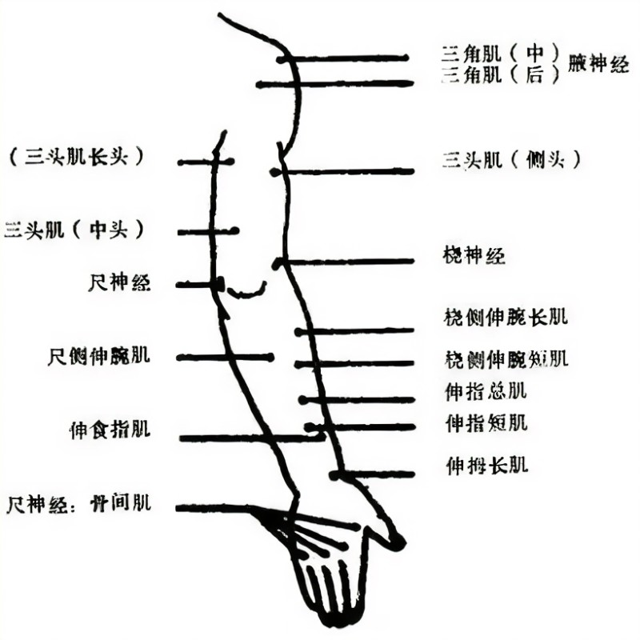

# 实践1

## 补充知识点1-运动点

应用电刺激时，在人体表面施加最小电流就能引起兴奋的神经肌肉区域，包括神经运动点和肌肉运动点。  
正常肌肉的运动点常为近肌腹区运动终板密集区，即运动神经进入肌肉的接点部位。  
神经运动点为运动神经走行部位最浅表或进入深层肌肉的部位。  
一条较长的肌肉或神经可以有几个运动点。

.jpg)
.jpg)

## 低频电实验课总要求

- 习惯养成
1. 使用治疗仪器前应检查治疗机是否能正常工作，电极，导线等是否好，导线插头，导线夹等是否牢固，旋钮是否灵敏；不得将有故障、破损、接触不良的治疗仪或附件用于治疗。
2. <u>旋钮仪器开机前务必将输出旋钮归零</u>
3. 微电脑控制低中频仪器先开机、后关机（即开机后放置电极，治疗结束时取下电极后再关机。）
4. 输出调整缓升缓降，若增加输出达一定强度但仍无感觉，需回零后检查导线连接。
5. 治疗前向患者交代应有的正常感觉。
6. 叮嘱患者电极下有任何异常感觉及时报告。
7. 治疗期间2-3次巡察询问。
8. 治疗结束取下电极检查皮肤状况。

## 低频电常见异常感觉与处理

### 异常感觉

- 1. 电极下疼痛感、灼烧感
- 2. 电极下点状刺痛
- 3. 两个电极均无感觉
- 4. 某一电极无感觉

### 处理

1. 遇1、2、3项立即强度旋钮回零/电脑中频复位
①取下电极观察皮肤有无点状红紫、水泡；
②检查电极有无裂痕、破损；
③检查仪器-导线、导线-极板连接状态；
2. 遇4项交换电极位置验证患者是否感觉减退。

## 关于低中频电剂量的描述

- 感觉阈：患者刚有感觉，即有很弱的麻木感。
- 感觉阈下：电流表有指示，患者无感觉。
- 感觉阈上：有明显的舒适麻颤感。
- 运动阈：电流强度刚能引起肌肉收缩。
- 运动阈上：电流强度能引起患者明显的肌肉收缩。
- 耐受量/限：电流加大到患者能耐受的最大限度。

## 如何读懂低中频电参数

- 频率
- 波形
- 脉冲周期与通断比、占空因数
- 脉冲串通断比