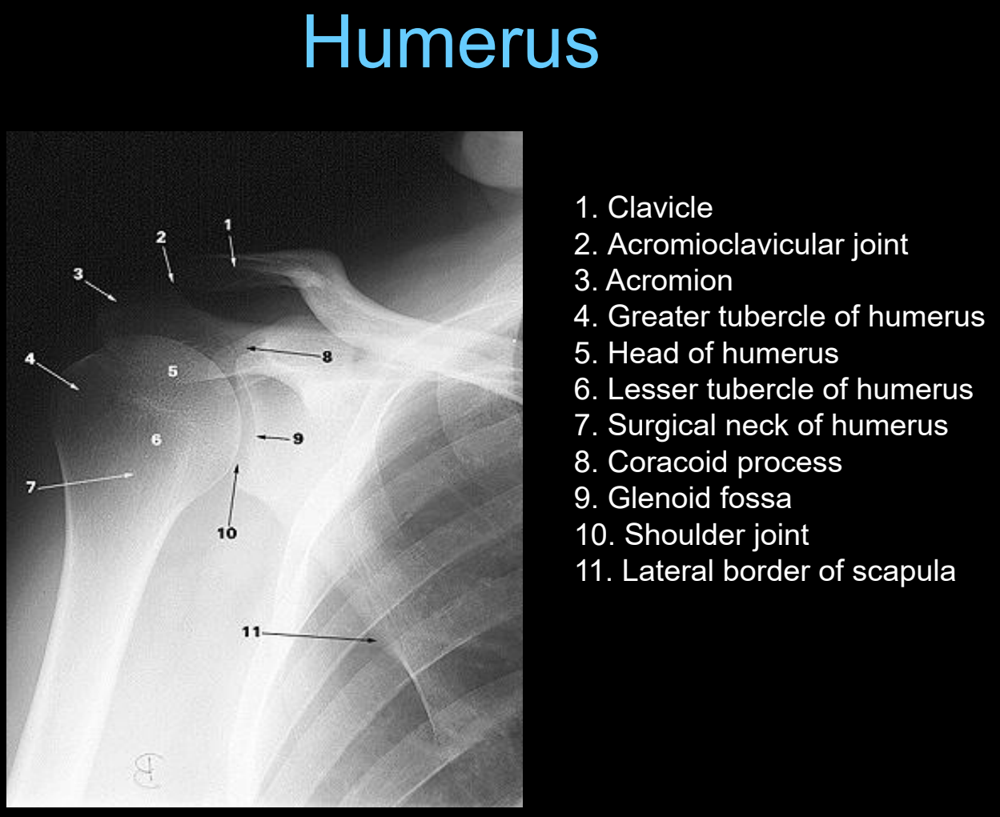
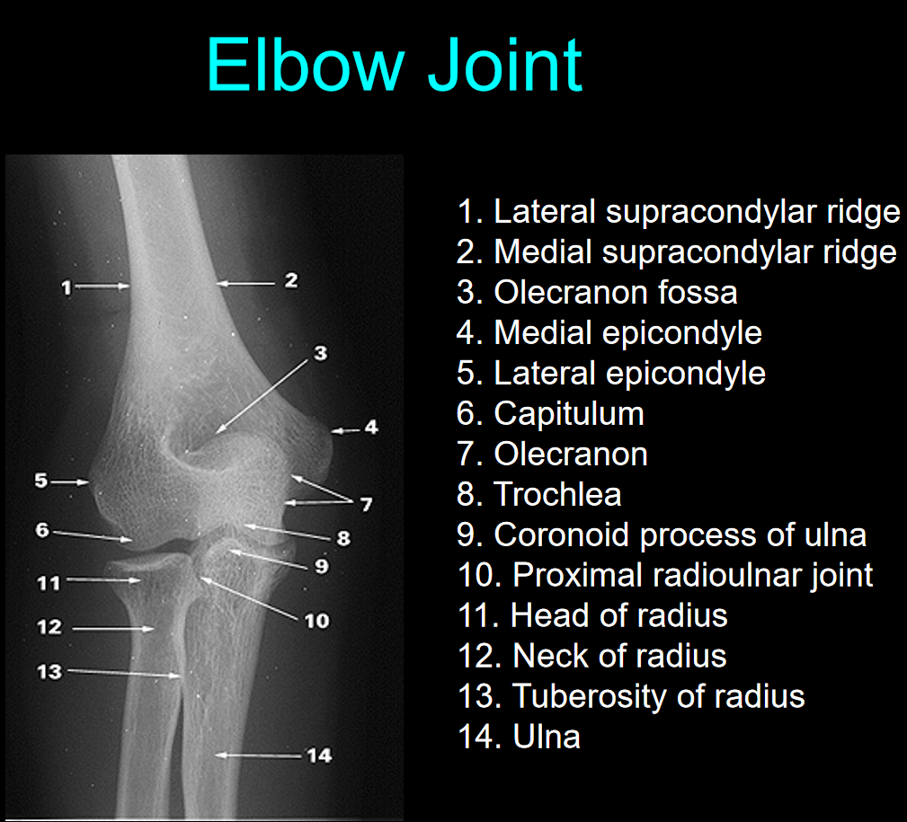
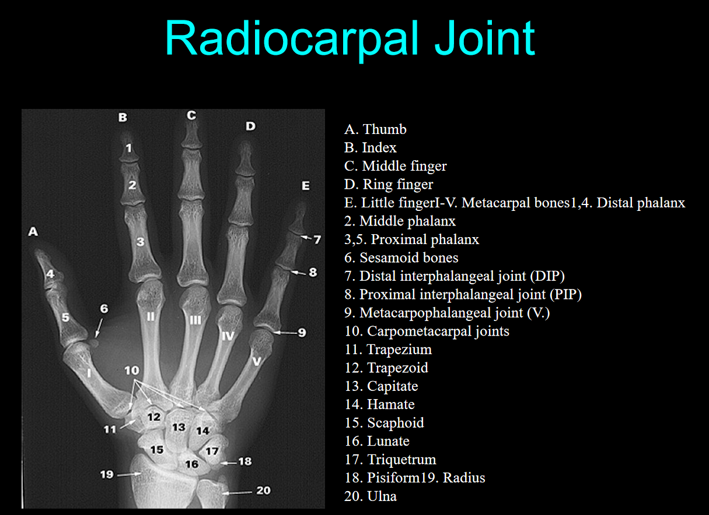
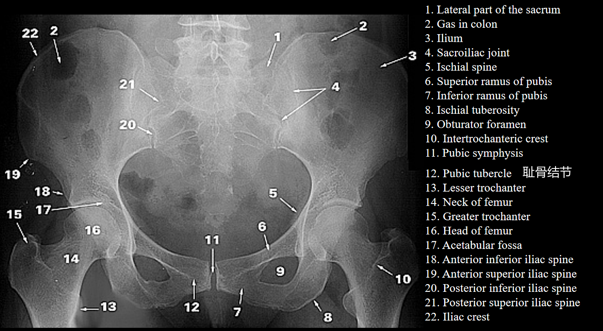
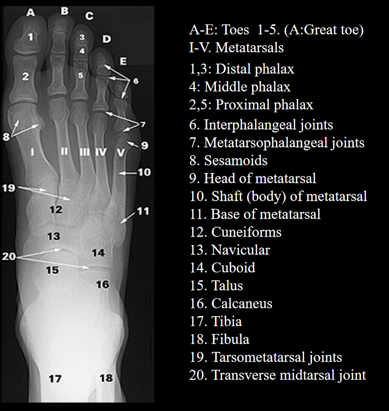

elevation 上抬
depression 下沉
protraction 前伸
retraction 后缩
circumduction 环转运动

planar joint 平面关节
hinge joint 
trochlea 滑车
head of radius
annular ligament 环状韧带
pivot joint 枢轴关节
saddle joint 鞍状关节
carpal 腕骨的
metacarpal 掌骨
phalangeal 指骨

coracoacromial ligament 喙肩韧带
coracohumeral ligament 喙肱韧带
acromioclavicular ligament 肩锁韧带
glenohumeral ligament 盂肱韧带
transverse humeral ligament 肱骨横韧带
trapezoid ligament 斜方韧带
conoid ligament 锥状韧带
subacromial bursa 肩峰下滑囊
tendon of biceps brachii muscle(long head)
tendon of supraspinatus muscle
**glenoid labrum 盂唇**

tendon of subscapularis muscle 肩胛骨下肌肌腱

coracoid process 喙突
subscapular bursa

rotator cuff 肩袖肌群

anatomical neck 解剖颈
intertubercular groove 结节间沟
surgical neck 外科颈

olecranon
lateral/medial epicondyle 内外上髁

lateral supracondylar ridge 外侧髁上嵴
olecranon fossa
coronoid process of ulna 尺骨冠状突
capitulum
tuberosity of radius
radiocarpal joint 桡腕关节

常考
sesamoid bones 籽骨
scaphoid 手舟骨
lunate 月骨
triquetrum 三角骨
pisiform
trapezium 大多角骨
trapezoid 小多角骨
capitate 头状骨
hamate 钩骨

rectus femoris tendon 股直肌肌腱

pubofemoral ligament 耻股韧带
iliofemoral ligament 髂股韧带
ischiofemoral ligament 坐股韧带

pubis symphysis
ischium 坐骨
intertrochanteric crest 转子间嵴
obturator canal

tibiofemoral joint 胫股关节

quadriceps femoris tendon 股四头肌肌腱
vastus medialis muscle
oblique popliteal ligament 腘斜韧带
popliteus muscle 腘肌
semimenbranosus muscle 半膜肌
semitendinosus muscle 半腱肌
adductor magnus tendon 大收肌肌腱
ALL:anterior cruciate ligament
PLL:posterior cruciate ligament

intercondylar eminence 髁间隆起
tibial tuberosity 胫骨粗隆

Soft palate 软腭
hard palate 硬腭
talocrural joint 距小腿关节

tarsal 跗骨
metatarsal 跖骨
phalanx 趾骨

常考

sternoclavicular joint 胸锁关节
acromioclavivular joint 肩锁关节
scapulothoracic joint 肩胛胸壁关节
glenohumeral joint 盂肱关节

costal cartilage

supraglenoid tubercle 盂上结节
infraglenoid tubercle 盂下结节

dislocation 错位，脱位