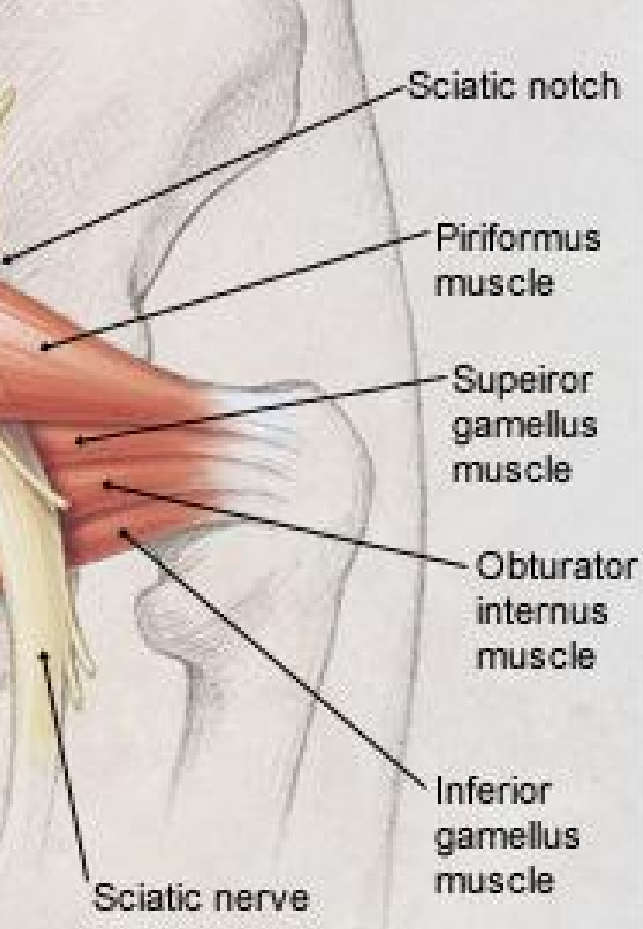

trapezius
accessory nerve Ⅺ
coracoacromial arch 喙肩弓

levator scapulae
rhomboid major/minor
serratus anterior
supraspinatus
infraspinatus
teres minor/major
subscapularis 肩胛下肌
deltoid tuberosity
Triangle of Auscultation 听诊三角
pectoralis minor/major
axillary artery 腋动脉
biceps brachii
coracobrachialis 喙肱肌

breast cancer 乳腺癌
right lymphatic duct 右侧淋巴管
acromioclavicular separation 肩锁分离

girdle 带
AC girdle 肩胛带
pelvic girdle 骨盆带
inguinal ligament 腹股沟韧带

ventral pelvic ligaments 骨盆前侧韧带
ventral dorsal ligaments 骨盆后侧韧带
sacrotuberous ligament 骶结节韧带
sacrospinous ligament 骶棘韧带
anterior sacroiliac ligament 骶髂前韧带
posterior sacroiliac ligament 骶髂后韧带

lumbosacral plexus 腰骶丛神经
ilioinguial nerve
lateral femoral cutaneous nerve 股外侧皮神经
femoral nerve 股神经
sciatic nerve 坐骨神经

piriformis muscle 梨状肌 不考
superior gemellus muscle 上孖肌 不考
inferior gemellus muscle 下孖肌 不考
obturator internus muscle 闭孔内肌 不考