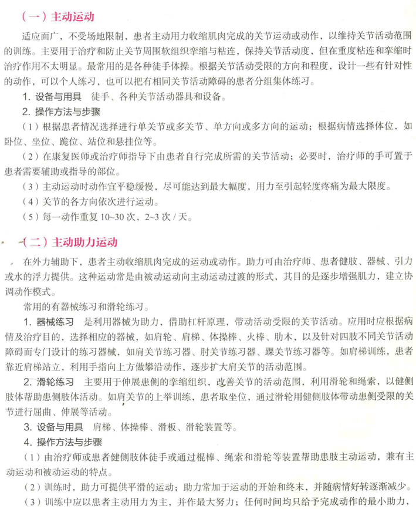
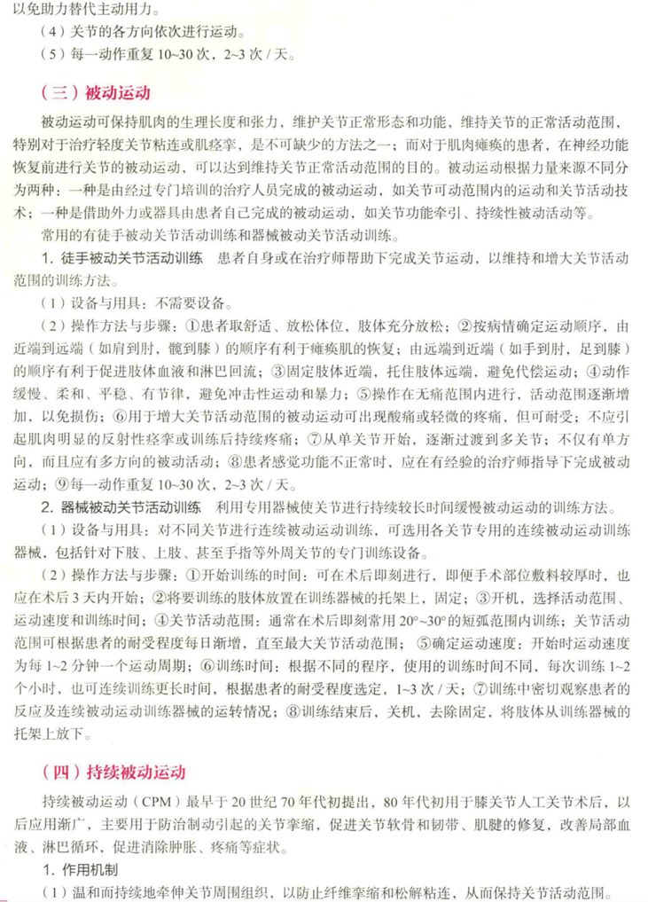

物理治疗学：是研究如何通过**功能训练、物理因子、手法治疗**来提高人体健康，预防和治疗疾病，恢复、改善或重建机体功能的一种医学相关学科。

随意运动：运动时没有任何外力（包括手力或器械力）的参与，动作完全由肌肉的主动收缩来完成。例如，自己活动四肢关节，行走，各种医疗体操，传统医学中的太极拳。

被动活动：运动时肌肉不收缩，肢体完全不用力，动作的整个过程由外力来完成。

- 关节可动范围运动
- 关节松动术
- 持续性被动活动（CPM）：是利用机械或电动活动装置，使肢体能进行持续性、无疼痛范围内的被动活动。

## 关节活动技术

关节活动技术：利用各种方法维持和恢复因组织粘连或肌肉痉挛等多种因素导致的关节功能障碍的运动治疗技术。

影响关节活动范围的因素
生理：①拮抗肌的肌张力。②软组织相接触。   ③关节的韧带张力。  ④关节周围组织的弹性情况。⑤骨组织的限制。
病理：①关节周围软组织疼痛。②关节周围软组织挛缩，黏连或痉挛。③肌力降低。④关节本身病变。

影响关节活动的损伤机制：
1. 促使致密结缔组织迅速形成
(1)制动：结缔组织纤维由网硬蛋白和胶原组成。制动将使胶原纤维和网硬蛋白沉积，形成致密的网状结构，取代了疏松的网状组织。
(2)创伤：创伤往往伤及毛细血管，蛋白质即通过损伤的管壁流入组织间隙，纤维蛋白原在组织间隙中沉积，形成胶原纤维基质，易于形成纤维化。
(3)水肿
(4)局部循环障碍：加速纤维化过程。
2. 粘连
3. 组织修复过程纤维蛋白和无定形基质的影响

改善关节活动的技术与方法:

适应证：
1. **主动和主动-辅助关节活动度练习** 患者可主动收缩肌肉，有或无辅助条件下可活动身体的该部分;肌肉较弱(低于3级)采用主动-辅助关节活动度练习，有氧练习时，多次重复的主动或主动-辅助关节活动度练习改善心血管和呼吸功能。
2. **被动关节活动度练习** 患者不能主动活动身体的该部分，昏迷、麻痹、完全卧床休息、存在炎症反应、关节挛缩粘连松解术后四肢骨折切开复位内固定术后、肌痉挛、主动关节活动导致疼痛等。
3. **特殊情况** 身体的某一部分处于制动阶段，为保持其上下相邻关节的功能，并为制动关节活动做准备;卧床患者避免循环不良、骨质疏松和心肺功能的降低。

禁忌证：
各种原因所致的关节不稳定、关节内未完全愈合的骨折、关节急性炎症或外伤所致的肿胀、骨关节结核和肿瘤。

关节活动的注意事项：
1. **熟悉关节的结构** 在进行关节被动运动时必须熟练掌握关节解剖学结构、关节的运动方向、运动平面及其各个关节活动范围的正常值等。
2. **早期活动** 在不加重病情、疼痛的情况下，尽早进行因伤病而暂时不能活动关节的被动活动，活动范围应尽可能接近正常最大限度的活动。
3. **全范围活动** 关节活动范围的维持训练应包括身体的各个关节，并且每个关节必须进行全方位范围的关节活动(如肘关节屈曲、伸展;肩关节的屈曲、伸展、内收、外展、外旋和内旋等 )。但每次活动只针对一个关节，在运动该关节时，要给予该关节一定的牵拉力，这样可减轻关节面之间的摩擦力，使训练操作容易进行，并能保护关节，防止关节面挤压。
4. **与肌肉牵伸结合** 对于跨越两个关节的肌群，应在完成逐个关节的活动后，对该肌群进行牵张。对于那些活动受限的关节或长期处于内收、屈曲位的关节，要多做被动牵拉运动，如牵拉跟腿维持踝关节的背屈活动、对屈曲的肘关节做伸展活动等。

制动对关节活动的影响：
(一)制动导致关节活动受限
(二)关节挛缩
1. 皮肤性挛缩
2. 结缔组织性挛缩
3. 肌源性挛缩
4. 神经源性挛缩（反射性、痉挛性、神经源性挛缩）

肩肱节律：正常肩上升同时伴一系列精确的协调运动，称肩肱节律。肩胛骨、肱骨均参与整个运动。在外展30°后，盂肱关节和肩胸关节按照2：1的比例外展。

## 体位转移技术

体位转移：即人体姿势转换和位置移动的过程，如翻身、床上移动、站起与坐下等。

- 独立转移：是指患者独自完成、不需要他人帮助的转移方法。
- 辅助转移：是指由治疗师或护理人员协助的转移方法。
- 被动转移：即搬运，是指患者因瘫痪程度较重而不能对抗重力完成独立转移及辅助转移时，完全由外力将患者整个从一个地方转移到另一个地方。一般分为人工搬运和机械搬运。

体位转移基本原则：
1. 治疗师或护理人员应熟知患者病情，以免对患者造成继发损伤和不必要的疼痛。如应知道患者有什么缺陷，体形、体重、瘫痪程度和认知力如何，需要何种方法和多大力度的帮助，没有把握时不要单独帮助患者转移。
2. 转移前治疗师或护理人员必须准备好必要的设施、器械，保证空间通畅，有多种转移方法可供选择时，以最安全、最容易的方法为首选。
3. 相互转移的两个平面的物体应稳定。例如轮椅转移时必须先制动手闸，活动床转移时应先锁住床的脚轮，椅子转移时应将其置于最稳定的位置。
4. 转移时应注意安全，避免家具或轮椅大轮、脚踏板碰伤肢体或臀部。如感觉减退的偏瘫侧上肢悬垂于轮椅大轮上。
5. 给患者的指令应简单、明确，与患者沟通时注意语言、文化差异，以便患者能正确理解、接收和执行。

体位转移方法的选择：
三种转移方法的选择没有绝对的原则:
1. 患者能够独立转移时则尽量不要帮助，能提供少量帮助时则不要提供大量帮助，而被动转移作为最后选择的转移方法。
2. 患者残疾较重或存在认知障碍时不要勉强训练其独立转移活动。
3. 转移距离过远时难以依靠一个人的帮助，转移频繁时不便使用升降机。

床上翻身，移动，坐→站，站→坐P38起（患者体位、治疗师体位、操作方法）

## 肌肉牵伸技术

牵伸：是指拉长挛缩或短缩软组织的治疗方法，目的主要为改善或重新获得关节周围软组织的伸展性，降低肌张力，增加或恢复关节的活动范围，防止发生不可逆的挛缩，预防或降低躯体在活动或从事某项运动时出现的 肌肉、肌腱损伤。

挛缩：是指由于各种原因导致的关节周围的软组织发生病理变化，软组织适应性缩短，造成关节障碍。

主动抑制：为使牵伸的阻力最小化，在肌肉牵伸前，嘱患者有意识地主动放松该肌肉，使肌肉收缩到自己主动的抑制。

牵伸的作用：
1. 改善关节的活动范围
2. 防止组织发生不可逆的挛缩
3. 调整肌张力，提高肌肉的兴奋性
4. 防治粘连、缓解疼痛
5. 预防软组织损伤

P80~83大题、案例

## 关节松动术

关节松动术：是现代康复治疗技术中的基本技能之一，是治疗师在患者关节活动允许范围内完成的一种手法操作技术，临床上用来治疗关节因力学因素导致的功能障碍如疼痛、活动受限或僵硬，具有针对性强、见效快、患者痛苦小、容易接受等特点。

生理运动：关节在生理范围内的运动。
附属运动：关节在允许范围内的运动。
生理运动与附属运动的关系：当关节因疼痛、僵硬而限制了活动时，其关节的生理运动和附属运动都有可能受到影响。如果生理运动恢复后，关节仍有疼痛或僵硬，则可能关节的辅助运动尚未完全恢复。治疗时通常在改善关节的生理运动之前，先改善关节的附属运动；而关节附属运动的改善，又可以促进关节生理运动的改善。

治疗平面：手法治疗中的一个假想平面，并垂直于关节的轴心。治疗时，凡属于分离或牵拉的手法，实施力的方向或是平行于治疗平面，或是垂直于治疗平面。凡属于滑动的手法，实施力的方向一定平行于治疗平面，而滚动手法，实施力的方向沿着治疗平面变化。

手法等级的选择：
I、II级：治疗因疼痛而引起的关节活动受限；III级：治疗关节疼痛伴有关节僵硬；IV：治疗关节因周围组织粘连、挛缩而引起的关节活动受限。

适应证：任何由于力学因素（非神经性）引起的关节功能障碍，包括关节疼痛、肌肉紧张；可逆性关节活动降低；进行性关节活动受限；功能性关节制动。
禁忌证：关节活动过度、外伤或疾病引起的关节肿胀（渗出增加）、关节急性炎症、恶性疾病以及未愈合的骨折。

关节松动术的操作程序：
(1)患者体位：治疗时，患者应处于一种舒适、放松、无疼痛的体位，尽量暴露所治疗的关节并使其放松，以达到最大范围的被松动。
(2)治疗师位置及操作手法：治疗时，治疗师应靠近所治疗的关节，一侧手固定关节的一端，一侧手松动另一端。
(3)治疗前评估：手法操作前，对拟治疗的关节先进行评估，分清具体的关节，找出存在的问题（疼痛、僵硬）及其程度。根据问题的主次，选择有针对性的手法。
(4)手法应用技巧：操作时应注意手法操作的运动方向，手法操作的幅度，手法操作的强度，治疗时间，治疗反应等。治疗中要不断询问患者的感觉，根据患者的反馈来调节手法强度。

关节松动术的治疗作用  ：①缓解疼痛。②改善关节活动范围。③增加本体反馈。

## 肌力训练技术

肌力下降的原因：①年龄增加。②失用性肌肉萎缩。③神经系统疾病。④肌源性肌肉萎缩。

肌力训练方法分类

1. **按照训练目的** 分为增强肌力训练和增强肌肉耐力训练.当康复目标为提升肌力时，应加大负荷量至1RM的40%以上，以募集更多的肌纤维参与活动，同时进行短时、快速的收缩训练:而以增强耐力为目的时，应采用负荷量不高于1RM的40%，延长训练时间，并反复收缩或持续收缩。
2. **按照肌力大小分类** 可分为被动训练、助力训练、主动训练、抗阻训练、渐进抗阻训练等运动方法。
3. **按照肌肉收缩的方式** 分为等长训练、等张训练和等速训练。肌力康复训练时应根据不同的康复目标和患者的自身情况选择不同的肌肉收缩形式和辅助手段。

适应症、禁忌症、注意事项P132

肌力：指肌肉收缩一次能产生的最大力量，又称绝对肌力。

肌耐力：指肌肉持续收缩或多次反复收缩的能力。其大小可以用肌肉开始收缩到出现疲劳时已收缩的总次数或经历的总时间来衡量。

等长训练：指肌肉收缩时，肌纤维的长度保持不变，也不产生关节运动，但肌肉能产生较大张力的一种训练方法，又称静力性训练。

等张训练：指肌肉收缩时，肌纤维的张力保持不变，而肌纤维的长度发生改变，并产生关节活动的一种训练方法。

等速训练：指利用等速仪器，根据运动过程中患者肌力大小的变化，由机器提供想匹配的阻力，使整个关节按照预先设定的速度进行运动的一种训练方法，又称可调节抗阻训练或恒定速度训练。

RM：1RM是指完成一个负重所能承受的最大重量。比如5RM是指采用一个重量在完成5次动作之后就再也无法成年完成第6次这个重量。

等长训练：
“TENS”训练：即每次肌肉收缩10次，然后休息10秒，10次为一组，每次训练十组。
多角度等长训练：是在整个关节活动范围内，每隔20°做一组等长练习。

抗阻训练：指患者在肌肉收缩过程中，需要克服阻力才能完成运动的一种训练方法。抗阻训练对增强肌力最为有效。主要适用于肌力3级以上的患者进行肌力训练。**渐进抗阻训练**是一种逐渐增加阻力的训练方法，肌力增强时，负荷量也随之增加。

超量恢复：是指肌肉或肌群经过适当的训练后，产生适度的疲劳。肌肉先经过疲劳恢复阶段，然后达到超量恢复阶段。在疲劳恢复阶段，训练过程中消耗的能源物质、收缩蛋白、酶蛋白恢复到运动前水平；在超量恢复阶段，这些物质继续上升并超过运动前水平，然后又逐渐降到运动前水平。所以，当下一次训练在前一次超量恢复阶段进行，就能以前一次超量恢复阶段的生理生化水平为起点，起到巩固和叠加超量恢复的作用，逐步实现肌肉形态的发展及功能的增强。

核心稳定性：是一种以稳定人体核心部位、控制重心运动、传递上下肢力量为主要目的的力量能力。

根据肌力大小选择训练方法
|肌力大小|训练方法|
|---|---|
|0级|被动运动、传递神经冲动训练|
|1~2级|传递神经冲动训练、等长训练、助力训练|
|3级|主动训练、等长训练、等张训练、助力训练|
|4~5级|主动训练、抗阻训练、等长训练、等张训练、等速训练|

## 牵引技术

牵引技术：是指运用作用力与反作用力的力学原理，通过外力（手法、器械或电动装置）作用于人体脊柱或四肢关节，使关节面发生一定的分离、关节周围软组织得到适当的牵伸，从而达到治疗目的的一种方法。

适、禁、注意事项看书P158起

## 悬吊技术

悬吊技术：是以持久改善肌肉骨骼疾病为目的的，应用主动治疗和训练的一个总的概念集合，是一种运动感觉的综合训练系统，强调在不稳定状态下进行，可加强中央躯干肌肉、髋部深层肌肉力量，提高身体在运动中的平衡、控制和稳定状态。

开链运动：肢体远端不固定且不承受身体重量或仅承担很少重量的运动（远端肢体在固定近端肢体基础上移动），运动过程只有一个支点（固定点）

闭链运动：肢体远端固定并承受身体重量所进行的运动（近端肢体基础上运动），运动过程包括两个支点（固定点）。

弱连接：从生物力学的角度讲，肢体的运动可以看作在由一个个关节构成的运动链上的传递。在一个动作中，某肌肉（通常是局部稳定肌）和其他肌肉一起工作时，它太弱以至于不能发挥它应有的作用，力的传递会受到干扰，出现局部动作完成不了的情况。

## 平衡与协调技术

平衡的定义 ：平衡是指物体所受到来自各个方向的作用力与反作用力大小相等，使物体处于 一种稳定的状态（即牛顿第一定律）。

分类：
(1)静态平衡:指的是人体或人体某一部位处于某种特定的姿势，例如坐或站等姿势时保持稳定的状态。
(2)动态平衡:包括两个方面:①自动态平衡:指的是人体在进行各种自主运动，例如由坐到站或由站到坐等各种姿势间的转换运动时，能重新获得稳定状态的能力:②他动态平衡:指的是人体对外界干扰，例如推、拉等产生反应、恢复稳定状态的能力。

平衡的维持机制：
1. 感觉输入
(1)视觉系统
(2)躯体感觉：皮肤感觉（触、压觉）和本体感觉
(3)前庭系统
2. 中枢整合
3. 运动控制
(1)踝策略：大支持面+小干扰
(2)髋策略：小支持面+大干扰
(3)跨步策略：外力干扰过大

影响平衡训练的因素  ： 
①支撑面积。
②平衡的条件 （重心与支撑面中心的连线同经过支撑面中心所做的垂线所形成的夹角，夹角越小越稳定）
③稳定极限（重心在支撑点上方摆动时所容许的最大角度   取决于支撑面的大小性质） 
④摆动频率
⑤与平衡有关的感觉作用（视觉 本体感觉  前庭感觉）
⑥与平衡有关的运动控制系统（牵张反射 不随意运动 随意运动）

平衡训练的原则 ：
1.安全性
2.循序渐进：①支撑面积由大到小。②稳定极限由大变小。③从静态平衡到动态平衡。④逐渐增加训练的复杂性。⑤从睁眼到闭眼。
3.个体化原则
4.综合性训练

## 神经发育技术

非对称紧张性紧反射（ANTR）：是当身体不动而颈部旋转时，头转向侧的肢体趋向于伸展，而另一侧的肢体趋向于屈曲，又名“拉弓反射”。

阳性支持反射 ：当足底受到刺激时，引起踝关节跖屈及髋关节、膝关节伸展。

联合反应：是脑卒中后的一种非随意的运动和反射性肌张力增高。

共同运动：是偏瘫患者期望完成某项患肢活动时引发的一种不可控制的运动模式，在用力时特别明显。

扩散：是指肌肉组织受到刺激后所产生的反应扩散至其他肌肉组织的现象。

关键点的控制： 治疗师通过操作者身体的某些部位，以达到抑制痉挛和异常姿势反射、促进 
正常反射的目的，称为控制关键点。 这些被操作的部位称之为关键点，人体中的关键点包括： 
中部关键点：头部、躯干、胸骨中下段
近端关键点：肩部、骨盆
远端关键点：上肢的拇指、下肢的拇趾

PNF动作模式：是在三个层面同时发生的组合运动，即在矢状面实施肢体的屈曲和伸展；在冠状面实施肢体的外展和内收或脊柱侧屈；在横断面实施肢体或躯干的旋转。

PNF适应证：
骨关节病、软组织损伤和脑卒中后偏瘫、脑瘫、脑外伤、脊髓损伤、帕金森病、脊髓灰质炎。

PNF禁忌证：
皮肤感觉障碍、皮肤感染、骨折或骨折未愈合、听力障碍、骨质疏松、无意识。

## 心肺功能训练

缩唇式呼吸：指吸气时用鼻子，呼气时嘴呈缩唇状施加一些抵抗，慢慢呼气的方法，

有氧运动：是指中等强度的大肌群、节律性、持续一定时间的、动力性、周期性运动，以提高机体氧化代谢能力的训练方法。有氧运动的根本目的是以安全有效的运动来增进身体功能并提高活动能力。

有氧运动的方式：
1. 步行和慢跑
2. 骑车
3. 游泳
4. 有氧舞蹈

## 运动再学习技术

运动再学技术：将成人中枢神经系统损伤后运动功能的恢复训练视为一种再学习过程，它主要以生物力学、运动学、神经学、行为学等为基础，在强调患者主动参与的前提下，以任务或功能为导向，按照科学的运动技能获得方法对患者进行再教育以恢复其运动功能。